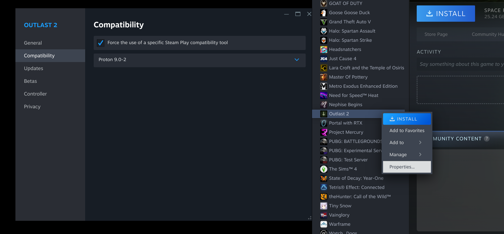
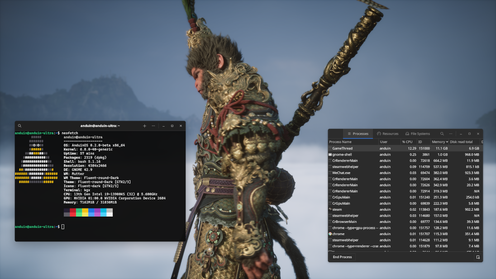

# Steam

Steam is a digital distribution platform developed by Valve Corporation, which offers digital rights management (DRM), multiplayer gaming, video streaming and social networking services. Steam provides the user with installation and automatic updating of games on multiple computers, and community features such as friends lists and groups, cloud saving, and in-game voice and chat functionality. The software provides a freely available application programming interface (API) called Steamworks, which developers can use to integrate many of Steam's functions into their products, including networking, matchmaking, in-game achievements, micro-transactions, and support for user-created content through Steam Workshop.

To install Steam on AnduinOS, you can run:

```bash title="Install Steam"
wget https://cdn.akamai.steamstatic.com/client/installer/steam.deb -O steam.deb
sudo apt install ./steam.deb -y
rm steam.deb
```

However, after installation, you will need to log in with your Steam account to download and play games. You can also install games from the Steam store using the Steam client.

!!! warning "Unable to automatically upgrade this application"

    The above command only installs the launcher. If you run `sudo apt upgrade`, it won't upgrade it automatically. You will need to manually rerun the above command to upgrade.

    This is because the software provider didn't setup a repository for automatic updates. You will need to check the official website for updates.

## Enable Proton for Steam

For some games which are not natively supported on Linux, you can use Proton to run them on Steam.

Proton is a new tool released by Valve Software that has been integrated with Steam Play to make playing Windows games on Linux as simple as hitting the Play button within Steam. Underneath the hood, Proton comprises other popular tools like Wine and DXVK among others that a gamer would otherwise have to install and maintain themselves. This greatly eases the burden for users to switch to Linux without having to learn the underlying systems or losing access to a large part of their library of games. Proton is still in its infancy so support is inconsistent, but regularly improving.

To enable Proton for a game on Steam, you can follow these steps:

1. Open Steam and go to `Steam` > `Library`.
2. Select the game you want to enable Proton for.
3. Right-click on the game and select `Properties`.
4. Go to the `Compatibility` tab.
5. Check the box that says `Force the use of a specific Steam Play compatibility tool`.
6. Select the version of Proton you want to use from the dropdown menu.
7. Click `Close` to save your changes.



Then just click `Install` and `Run` to launch the game. Steam will automatically use Proton to run the game.



## Install Xbox Controller Driver

By default, your Xbox Controller may not work properly on AnduinOS. You can install the Xbox Controller driver to mitigate this issue.

Please [read the Xbox Controller Driver Installation Guide](../../../Install/Install-Drivers.md#install-xbox-controller-driver) for more details.

## Uninstall Steam

To uninstall Steam from AnduinOS, you can run:

```bash
sudo apt purge steam-installer steam-launcher -y
sudo apt autoremove -y
```

If you also want to remove the `i386` architecture, you can run:

```bash
sudo dpkg --remove-architecture i386
sudo apt autoremove libc6-i386 libutempter0 xbitmaps xterm libgl1-mesa-dri:i386 libgl1:i386 -y
sudo apt update
```
