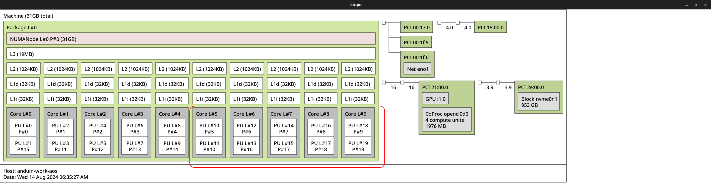

# Virt Manager

!!! tip "AnduinOS Verified App - Open Source"

    Virt Manager is an AnduinOS verified app and it runs awesome on AnduinOS, with easy installation and automatic updates.

Virt Manager is a graphical tool for managing virtual machines. It is based on libvirt and supports KVM, QEMU, Xen, and LXC. It is written in Python and uses GTK+ for the graphical user interface.

To install Virt Manager on AnduinOS, you can run:

```bash title="Install Virt Manager"
sudo apt update
sudo apt install virt-manager
```

That's it. If you want to allow current user to connect to the libvirt daemon, you can run:

```bash title="Allow running Virt Manager without sudo"
sudo adduser $USER libvirt
sudo adduser $USER kvm
```

However, after installing Virt Manager, you may need to configure some settings to optimize the performance of your virtual machines.

* Setting up IO-MMU
* Ignore MSRs
* Offline a PCIe Device (Like GPU) Before Passing Through
* Pass through a PCIe Device (Like GPU) to a Virtual Machine
* Enable Secure Boot for Virtual Machines
* Enable simulated TPM for Virtual Machines
* Install VirtIO drivers for Windows VM
* Tune Windows VM for better performance

## Setting up IO-MMU

In some cases, you may need to pass through a PCIe device to a virtual machine. For example, if you want your virtual machine to have direct access to a GPU.  To do this, you need to enable IOMMU in the BIOS and add the `iommu=pt` kernel parameter.

To enable IOMMU in the BIOS, you need to reboot your system, press `F2` or `Delete` to enter the BIOS settings, and enable IOMMU in the settings. On Intel PCs, it may be called `VT-d`, and on AMD PCs, it may be called `AMD-Vi`.

Then you need to [Edit kernel parameter](../../../Skills/System-Management/Update-Kernel-Parameters.md).

* `hugepagesz=1G` and `default_hugepagesz=2M` will enable huge pages with a size of 1GB and 2MB. It may improve the performance of the virtual machine.
* `intel_iommu=on` and `iommu=pt` will enable IOMMU and pass-through mode. For AMD CPUs, you can use `amd_iommu=on` and `iommu=pt`.
* `cpufreq.default_governor=performance` will set the CPU frequency governor to performance mode. It may improve the performance of the virtual machine.

Finally, my GRUB configuration file looks like this:

```bash title="GRUB configuration file"
GRUB_CMDLINE_LINUX_DEFAULT="quiet splash hugepagesz=1G default_hugepagesz=2M intel_iommu=on iommu=pt cpufreq.default_governor=performance"
```

Make sure to update the GRUB configuration and reboot your system to apply the changes.

```bash title="Update GRUB configuration"
sudo update-grub
sudo reboot
```

After rebooting, you can check if IOMMU is enabled by running:

```bash title="Check IOMMU"
#!/bin/bash
shopt -s nullglob
for d in /sys/kernel/iommu_groups/*/devices/*; do
    n=${d#*/iommu_groups/*}; n=${n%%/*}
    printf 'IOMMU Group %s ' "$n"
    lspci -nns "${d##*/}"
done;
```

If you see the IOMMU groups, it means IOMMU is enabled. You can now pass through a PCIe device to a virtual machine.

## Ignore MSRs

In some cases, you may need to ignore MSRs (Model Specific Registers). This is because some drivers may touch some MSRs that are not allowed in the virtual machine. To ignore MSRs, you need to add the `kvm.ignore_msrs=1` kernel parameter.

To do that, run the following command:

```bash title="Ignore MSRs"
echo "options kvm ignore_msrs=1" | sudo tee /etc/modprobe.d/vfio.conf
```

Then update the initramfs and reboot your system:

```bash title="Update initramfs"
sudo update-initramfs -u -k all
sudo reboot
```

That's it! Now you can pass through a PCIe device to a virtual machine.

## Offline a PCIe Device Before Passing Through

For example, if you want to pass through a GPU to a virtual machine, you need to offline the GPU before passing it through. To do this, you can follow these steps:

First, you need to know the PCI address of the GPU. You can find it by running:

```bash title="Find PCI Address"
lspci
```

For example, I have two NVIDIA Quadro P620 GPUS. The addresses are `15:00.0` to `15:00.1` and `21:00.0` to `21:00.1`. You can see the addresses by running:

```bash
anduin@anduin-work-aos:~$ lspci | grep NVIDIA
15:00.0 VGA compatible controller: NVIDIA Corporation GP107GL [Quadro P620] (rev a1)
15:00.1 Audio device: NVIDIA Corporation GP107GL High Definition Audio Controller (rev a1)
21:00.0 VGA compatible controller: NVIDIA Corporation GP107GL [Quadro P620] (rev a1)
21:00.1 Audio device: NVIDIA Corporation GP107GL High Definition Audio Controller (rev a1)
```

!!! note "Multiple devices in the same IOMMU group"

    In the example above, NVIDIA Quadro P620 and it's audio device are listed. And the two devices are in the same IOMMU group. You need to offline both devices.

Then you need to tell Linux kernel to unbind the GPU from the driver. You can do this by running:

!!! warning "Update the ID to your GPU ID!"

    Update the ID in the script below to your GPU ID. For example, I want to pass through `21:00.0` and `21:00.1`, so I will update the script below to `0000:21:00.0` and `0000:21:00.1`. Update the values to your own PCIe address!

```bash title="Unbind a PCIe Device"
cat << EOF > /etc/initramfs-tools/scripts/init-top/vfio.sh

PREREQS=""

prereqs() { echo "$PREREQS"; }

case "$1" in
    prereqs)
    prereqs
    exit 0
    ;;
esac

#!/bin/sh

for dev in 0000:21:00.0 0000:21:00.1 # Update the values to your own PCIe address!
do 
 echo "vfio-pci" > /sys/bus/pci/devices/\$dev/driver_override 
 echo "\$dev" > /sys/bus/pci/drivers/vfio-pci/bind 
done

exit 0
EOF
sudo chmod +x /etc/initramfs-tools/scripts/init-top/vfio.sh
```

Then update the initramfs and reboot your system:

```bash title="Update initramfs"
sudo update-initramfs -u -k all
sudo reboot
```

To make sure a PCIe device is offline and ready to pass through, you can run:

```bash title="Verify Isolation"
lspci -nnv -s 21:00.0 # Update the address `21:00.0` to your own PCIe address!
```

For example, for my NVIDIA P620 on `21:00.0` it shows:

```bash
anduin@anduin-work-aos:~$ lspci -nnv -s 21:00.0
21:00.0 VGA compatible controller [0300]: NVIDIA Corporation GP107GL [Quadro P620] [10de:1cb6] (rev a1) (prog-if 00 [VGA controller])
    ...
    Kernel driver in use: vfio-pci
```

And for the other device `15:00.0`:

```bash
anduin@anduin-work-aos:~$ lspci -nnv -s 15:00.0
15:00.0 VGA compatible controller [0300]: NVIDIA Corporation GP107GL [Quadro P620] [10de:1cb6] (rev a1) (prog-if 00 [VGA controller])
    ...
    Kernel driver in use: nvidia
```

If you see the `Kernel driver in use: vfio-pci`, it means the GPU is offline and ready to pass through.

!!! danger "Dangerous if you only have one GPU!!"

    If you only have one GPU, offline it may cause the display to go black! In this case, make sure you have a remote connection and a virtual adapter on your machine before offline the GPU.

## Pass through a PCIe Device

To pass through a PCIe device to a virtual machine, you can follow these steps:

First, open `Virt-Manage` and create a new virtual machine. Then, go to `Edit` -> `Preferences` -> `General` and enable `Enable XML editing`.

### Pass through via GUI

Then, open your virtual machine. Click `Show virtual hardware details` -> `Add Hardware` -> `PCI Host Device` and add the PCIe device you want to pass through.

### Pass through via XML

And also you can add the following lines to the XML configuration:

The `<hostdev>.<source>.<address>` is the address of the PCIe device you want to pass through. You can find the address by running `lspci`.

For example, when I want to pass through `0000:21:00.0` and `0000:21:00.1`, I will add the following lines to the XML configuration:

The `<hostdev>.<alias>` is the name of the device. You can name it with `hostdev0`, `hostdev1`, etc.

The `<hostdev>.<address>` is the address of the PCIe device in the virtual machine. You can set the domain, bus, slot, and function of the device.

```xml title="Pass through a PCIe Device"
<devices>
    ...
    <hostdev mode="subsystem" type="pci" managed="yes">
        <driver name="vfio"/>
        <source>
            <!-- Pass through the address of 0000:21:00.0 -->
            <address domain="0x0000" bus="0x21" slot="0x00" function="0x0"/>
        </source>
        <alias name="hostdev0"/>
        <!-- I take the bus 0x06 in virtual machine -->
        <address type="pci" domain="0x0000" bus="0x06" slot="0x00" function="0x0"/>
    </hostdev>
    <hostdev mode="subsystem" type="pci" managed="yes">
        <driver name="vfio"/>
        <source>
            <!-- Pass through the address of 0000:21:00.1 -->
            <address domain="0x0000" bus="0x21" slot="0x00" function="0x1"/>
        </source>
        <alias name="hostdev1"/>
        <!-- I take the bus 0x07 in virtual machine -->
        <address type="pci" domain="0x0000" bus="0x07" slot="0x00" function="0x0"/>
    </hostdev>
    ...
</devices>
```

!!! warning "Update the XML to match your own PCIe address!"

    Update the XML configuration to match your own PCIe address. And the address in the virtual machine should be unique.

## Enable Secure Boot for Virtual Machines

For Windows virtual machines, you may want to enable Secure Boot to improve the security of the virtual machine. Secure Boot is a feature of UEFI that ensures that the system only runs software that is signed by a trusted certificate authority. If you want to enable Secure Boot for your virtual machines, you need to adjust the settings of the virtual machine.

First, open `Virt-Manage` and create a new virtual machine. Then, go to `Edit` -> `Preferences` -> `General` and enable `Enable XML editing`.

Then, open your virtual machine. Click `Show virtual hardware details` -> `Overview` and add the following lines to the XML configuration:

```xml title="Enable Secure Boot"
<os firmware="efi">
    ...
    <firmware>
        <feature enabled="yes" name="enrolled-keys"/>
        <feature enabled="yes" name="secure-boot"/>
    </firmware>
    ...
</os>
```

## Enable simulated TPM for Virtual Machines

TPM is a hardware-based security feature that provides a secure way to store cryptographic keys and perform cryptographic operations. A lot of Windows features require TPM, such as BitLocker, Windows Hello, and Windows Defender Credential Guard.

If you want to enable a simulated TPM for your virtual machines, you need to adjust the settings of the virtual machine.

First, install `swtpm` by running the following command on host:

```bash
sudo apt install swtpm swtpm-tools
```

Then, open `Virt-Manage` and create a new virtual machine. Then, go to `Edit` -> `Preferences` -> `General` and enable `Enable XML editing`.

Then, open your virtual machine. Click `Show virtual hardware details` -> `Overview` and add the following lines to the XML configuration:

```xml title="Enable simulated TPM"
<devices>
    ...
    <tpm model="tpm-tis">
      <backend type="emulator" version="2.0"/>
    </tpm>
    ...
</devices>
```

## Install VirtIO drivers for Windows VM

!!! note "Best practice for Windows VM"

    It is suggested that when you are configuring a Windows virtual machine, you should always use VirtIO devices. For example

    * For network adapter, use VirtIO network adapter instead of Intel E1000.
    * For disks, use SCSI VirtIO disk.
    * Always add a VirtIO Serial controller.
    * Always add a VirtIO SCSI controller.
    * Always add a RNG device, based on `/dev/urandom`.

If you are using a Windows virtual machine, you may want to install VirtIO drivers to improve the performance of the virtual machine. To do this, you can follow these steps:

!!! note "Windows may not boot without VirtIO drivers"

    During Windows setup, it may not have the VirtIO drivers. In this case, Windows may not boot. You need to install the VirtIO drivers during the setup.

Download the VirtIO drivers from the official website: [https://fedorapeople.org/groups/virt/virtio-win/direct-downloads/stable-virtio/virtio-win.iso](https://fedorapeople.org/groups/virt/virtio-win/direct-downloads/stable-virtio/virtio-win.iso)

Then, open your virtual machine. Click `Show virtual hardware details` -> `Add Hardware` -> `Storage` and add the VirtIO drivers ISO file.

Then, boot your virtual machine and install the VirtIO drivers. If you are installing Windows, it will prompt you to insert the VirtIO drivers CD. You can insert the VirtIO drivers ISO file and install the drivers.

After Windows is installed, it's always suggested to install the VirtIO drivers to improve the performance of the virtual machine.

## Tune Windows VM for better performance

Windows only enable some performance feature when it detects that it is running on a Hyper-V hypervisor. To enable these features, you can add the following lines to the XML configuration:

First, open `Virt-Manage` and create a new virtual machine. Then, go to `Edit` -> `Preferences` -> `General` and enable `Enable XML editing`.

Then, open your virtual machine. Click `Show virtual hardware details` -> `Overview` and add the following lines to the XML configuration:

```xml title="Enable Hyper-V features for better performance"
<features>
    ...
    <hyperv mode="passthrough">
        <relaxed state="on"/>
        <vapic state="on"/>
        <spinlocks state="on" retries="8191"/>
        <vpindex state="on"/>
        <runtime state="on"/>
        <synic state="on"/>
        <stimer state="on"/>
        <reset state="off"/>
        <vendor_id state="on" value="intel"/>
        <frequencies state="on"/>
        <reenlightenment state="off"/>
        <tlbflush state="on"/>
        <ipi state="on"/>
    </hyperv>
    ...
</features>
```

That's it! Now you can try benchmarking your virtual machine to see if the performance is improved.

## Isolate CPU Cores for Virtual Machines

By default, the CPU cores are shared among all virtual machines. This will cause the CPU scheduler by both VM and host to cause additional latency.

It is suggested to isolate CPU cores for virtual machines, you can follow these steps:

First, open `Virt-Manage` and create a new virtual machine. Then, go to `Edit` -> `Preferences` -> `General` and enable `Enable XML editing`.

Then, open your virtual machine. Click `Show virtual hardware details` -> `Overview` and edit the XML configuration.

First, edit the domain XML and add the following lines:

```xml title="Edit the domain XML"
<domain xmlns:qemu="http://libvirt.org/schemas/domain/qemu/1.0" type="kvm">
  ...
</domain>
```

Then, add the following lines to the XML configuration:

```xml title="Set CPU overcommit"
<domain xmlns:qemu="http://libvirt.org/schemas/domain/qemu/1.0" type="kvm">
  ...
  <qemu:commandline>
    <qemu:arg value="-overcommit"/> 
    <qemu:arg value="cpu-pm=on"/>
  </qemu:commandline>
  ...
</domain>
```

And now you need to plan your CPU cores for the virtual machine.

!!! note "A sample plan for isolating half of the Intel Hyper-Threading CPU cores (10 cores 20 threads)"

    "Hyper-Threading" is a technology that allows a single physical CPU core to act as two logical CPUs. 20 Logical CPUs will be shown as `0-19` in the system.

    In my case, I want my virtual machine to have half of the physical CPU performance. So I want to bind 0-4 physical cores (0-9 logical CPUs) to the host and 5-9 physical cores (10-19 logical CPUs) to the virtual machine.

First you need to understand which logical CPU cores numbers are in the same physical core. You can run the following command to find out:

```bash title="Find out CPU core numbers"
sudo apt install hwloc
sudo lstopo
```

It may output a graph like this:



And as the topology shows, the logical CPU cores `10-19` are in physical core `5-9`. You can isolate the CPU cores by editing the domain XML:

* I want to bind 5 cores
* 5 x 2 = 10, so 10 logical CPUs are needed
* the `0-9` CPUs in virtual machine are `10-19` in the host
* threads should be 2
* cores should be 5
* dies should be 1
* sockets should be 1

```xml title="Isolate CPU cores"
<domain xmlns:qemu="http://libvirt.org/schemas/domain/qemu/1.0" type="kvm">
  ...
  <!-- 10 logical CPUs -->
  <vcpu placement="static">10</vcpu>

  <!-- the `0-9` CPUs in virtual machine are `10-19` in the host -->
  <cputune>
    <vcpupin vcpu="0" cpuset="10"/>
    <vcpupin vcpu="1" cpuset="11"/>
    <vcpupin vcpu="2" cpuset="12"/>
    <vcpupin vcpu="3" cpuset="13"/>
    <vcpupin vcpu="4" cpuset="14"/>
    <vcpupin vcpu="5" cpuset="15"/>
    <vcpupin vcpu="6" cpuset="16"/>
    <vcpupin vcpu="7" cpuset="17"/>
    <vcpupin vcpu="8" cpuset="18"/>
    <vcpupin vcpu="9" cpuset="19"/>
  </cputune>

  <!-- CPU topology, threads should be 2, cores should be 5, dies should be 1, sockets should be 1 -->
  <cpu mode="host-passthrough" check="none" migratable="on">
    <topology sockets="1" dies="1" cores="5" threads="2" />
  </cpu>
  ...
</domain>
```

As the configuration above, the virtual machine will use the CPU cores `10-19` and the CPU topology is set to 5 cores and 2 threads (Hyper-Threading), on one socket and one die.

After that, you can start the virtual machine and check if the CPU cores are isolated. You should see 10-19 CPUs usage on the host is always 100%.

!!! note "Why CPU usage is always 100% on host?"

    You will see the CPU usage of 10-19 on your host shows always 100% when the virtual machine is running. It is expected behavior because host scheduler no longer schedules the isolated CPU cores. Those cores are over-committed to the virtual machine. But don't worry, the virtual machine will not actually use 100% of the CPU. To check the actual usage, you can check inside the virtual machine, or running:

    ```bash
    sudo apt install linux-tools-common
    sudo turbostat
    ```

    And check the `Busy%` column.

And you don't have to turn your host's CPU frequency governor to performance mode. The virtual machine will have its own CPU frequency governor.

Instead, setting it to `powersave` may save power and reduce heat on the host. You can run the following command to set the CPU frequency governor to `powersave`:

```bash title="Check CPU frequency governor"
sudo cpupower frequency-set -g powersave
```
