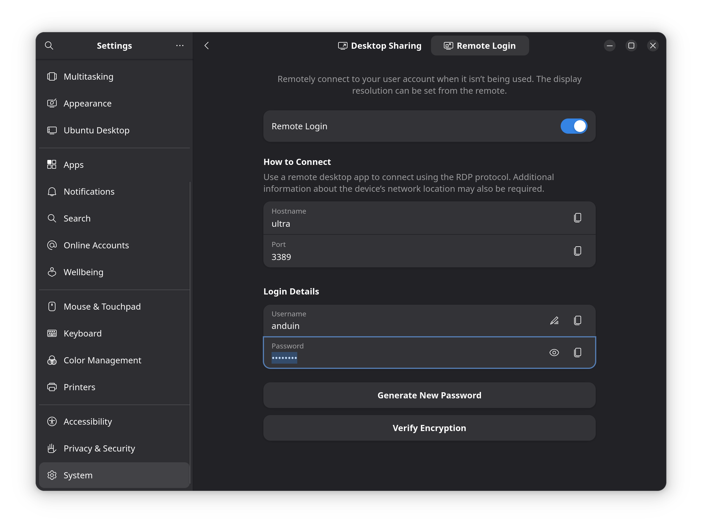

# Enable RDP to AnduinOS

RDP is a remote desktop protocol that allows you to connect to a computer and control it remotely.

## Setup RDP Server on AnduinOS

To enable RDP on AnduinOS, follow these steps.

First, ensure that you have the necessary packages installed. Open a terminal and run the following command:

```bash title="Enable RDP on AnduinOS"
sudo apt update
sudo apt install gnome-remote-desktop # This is installed by default on AnduinOS
```

Then, go to the `gnome settings` -> `System` -> `Remote Desktop` and enable the remote login option.

You need to set a password for the remote login. This username and password only applies and protects the remote desktop connection, not the user account on AnduinOS. The client will still need to log in with the user account credentials.



If you have a firewall enabled, you need to allow the RDP port (3389) through the firewall. You can do this by running the following command:

```bash title="Allow RDP through firewall"
sudo ufw allow 3389/tcp
```

## Connect to AnduinOS via RDP

Now that RDP is set up on AnduinOS, you can connect to it from another computer using an RDP client.

On Windows, you can use the built-in Remote Desktop Connection application. Simply search for "Remote Desktop Connection" in the Start menu, enter the IP address of your AnduinOS machine, and click "Connect".

On Linux, you can use an RDP client like `Remmina` or `rdesktop`. For example, to install Remmina, run:

```bash title="Install Remmina on Linux"
sudo apt install remmina
```

Then, open Remmina, create a new connection, and enter the IP address of your AnduinOS machine. Select the RDP protocol and enter the username and password you set up earlier.
