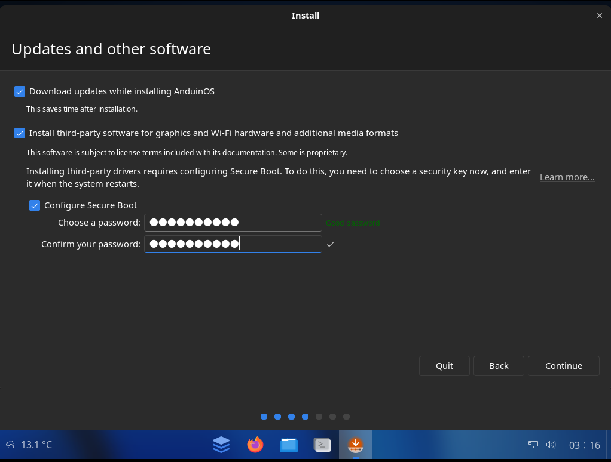
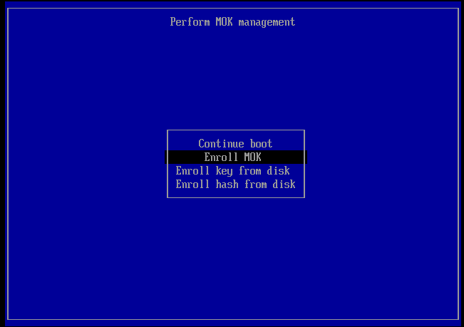

# Before installation - Turn on Secure Boot to 3rd Party CA

!!! warning "Adjust Secure boot settings in your BIOS!"

    AnduinOS supports Secure boot well. During the installation, it is very recommended to turn on Secure Boot to ensure the security of your system. If you have already installed AnduinOS without Secure Boot, you can turn on Secure Boot at any time. However, you may need to sign the kernel modules manually if you have installed third-party kernel modules.

    

To turn on Secure Boot, you need to enter BIOS settings first. The key to enter BIOS settings varies depending on the manufacturer of your computer. Common keys include `F2`, `F10`, `Volume up + Power` or `Del`. You can usually see the key to enter BIOS settings on the boot screen when you start your computer.

Boot your computer, press `F2` or the key to enter BIOS settings, and then find the Secure Boot option in the BIOS settings. Enable Secure Boot and save the changes. Set the Secure Boot certificate to `Linux` or `3rd Party CA`. After that, you can boot your computer from the AnduinOS USB drive and install AnduinOS.

## Set the Password for Secure Boot during installation

During the installation process, you will be asked to set a password for Secure Boot. This password is required to enroll the AnduinOS Secure Boot key during the first boot.

In the installation process, you will see the following screen to set the password for Secure Boot:



Enter a password and confirm it. This password will be used to enroll the AnduinOS Secure Boot key during the first boot.

!!! note "The password for Secure Boot is not the same as the user password."

    After setting the password, you can continue the installation process as usual. The password is used to enroll the AnduinOS Secure Boot key during the first boot.

    Do NOT leak the password to others! Or they will be able to enroll the AnduinOS Secure Boot key on your computer. This may cause security risks like running malicious kernel modules.

## Trust the AnduinOS Secure Boot key during first boot

When you boot AnduinOS for the first time with Secure Boot enabled, you will see a blue screen asking you to trust the AnduinOS Secure Boot key. This is a one-time operation to ensure that the AnduinOS kernel and kernel modules are signed by a trusted key.

You must select the `Enroll MOK` option and follow the on-screen instructions to enroll the AnduinOS Secure Boot key.



You will be asked to enter the password for the MOK (Machine Owner Key) and reboot your computer.

The password was set during the installation process.


After that, your system will trust the signed AnduinOS kernel and kernel modules. And you can run custom kernel modules with Secure Boot enabled.

## Verify Secure Boot status

To verify that Secure Boot is enabled, you can boot AnduinOS on your computer and run the following command in the terminal:

```bash title="Check Secure Boot status"
$ sudo mokutil --sb-state
SecureBoot enabled
```

You should see `SecureBoot enabled` in the output, which means Secure Boot is enabled on your computer.
