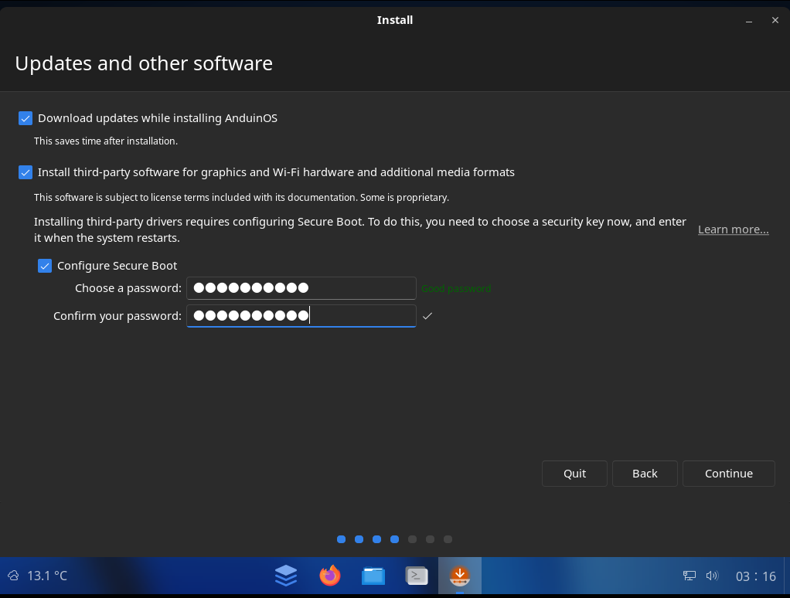

# Install AnduinOS by Booting from a USB Drive

---

After burning the AnduinOS ISO file to a USB drive in the [previous step](./Burn-A-USB-Stick.md), you can boot your computer from the USB drive to install AnduinOS. This guide will show you how to boot from a USB drive on different systems.

## Turn on Secure Boot

!!! warning "Turn on Secure Boot!"

    AnduinOS supports Secure boot well. During the installation, it is very recommended to turn on Secure Boot to ensure the security of your system.

To turn on Secure Boot, you need to enter BIOS settings first. The key to enter BIOS settings varies depending on the manufacturer of your computer. Common keys include `F2`, `F10`, `Volume up + Power` or `Del`. You can usually see the key to enter BIOS settings on the boot screen when you start your computer.

Boot your computer, press `F2` or the key to enter BIOS settings, and then find the Secure Boot option in the BIOS settings. Enable Secure Boot and save the changes. Set the Secure Boot certificate to `Windows`. After that, you can boot your computer from the AnduinOS USB drive and install AnduinOS.

## Boot from USB

The key to enter the boot devices menu varies depending on the manufacturer of your computer. Common keys include `F12`, `F11`, `Esc`, `F10`, or `Volume down + Power`.

Boot your computer, press the key to enter the boot devices menu, and then select the USB drive from the boot menu. Your computer will boot from the USB drive, and you will see the AnduinOS installer screen.

## Change NVME LBA Format

Before actual installation, you may need to change the NVME LBA format to the suggested value for best performance. Please refer to the [Change NVME LBA Size](./Change-NVME-LBA-Size.md) guide for more information.

## Installation Process

The installation process will guide you through the following steps:

1. **Select Language**: Choose the language you want to use during the installation process.
2. **Select Keyboard Layout**: Choose the keyboard layout you want to use.
3. **Updates and Other Software**: Choose whether you want to install updates and third-party software during the installation process.
4. **Setup Disk**: Choose the disk where you want to install AnduinOS. You can also choose to encrypt the disk with LVM and LUKS2.
5. **Location**: Choose your location to set the time zone, locale formats and apt source.
6. **User Information**: Enter your name, username, and password for the new user account.
7. **Installation**: The installation process will start, and you can see the progress on the screen.
8. **Complete**: Once the installation is complete, you will be prompted to restart your computer.

## Set the Password for Secure Boot during installation

During the installation process, you will be asked to set a password for Secure Boot. This password is required to enroll the AnduinOS Secure Boot key during the first boot.

In the installation process, you will see the following screen to set the password for Secure Boot:

Enter a password and confirm it. This password will be used to enroll the AnduinOS Secure Boot key during the first boot.

## First boot and setup Secure Boot

After the installation is complete, you can restart your computer and boot into AnduinOS. During the first boot, you may need to set up some configurations like Secure Boot, display settings, and other preferences.

Please follow the [First-Boot-For-Secure-Boot.md](./First-Boot-For-Secure-Boot.md) guide to set up Secure Boot and other configurations during the first boot.
