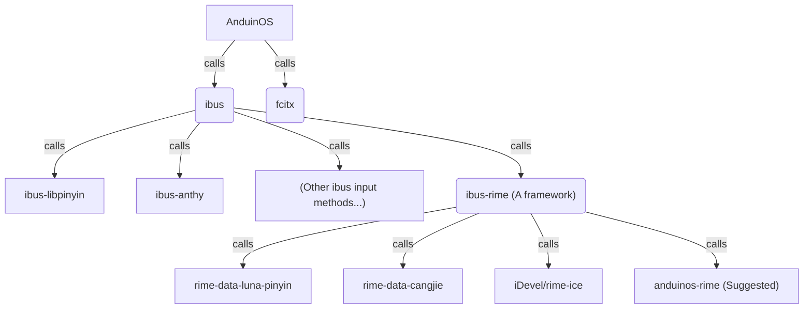

# Install Input Method

By default, AnduinOS uses `ibus` as the input method framework.

During the installation, the installer may installed an `ibus` input method engine for you.

For example:

* if you choose `Chinese` as the default language, the installer will install [ibus-libpinyin](https://github.com/libpinyin/ibus-libpinyin) for you.
* If you choose `Japanese` as the default language, the installer will install [ibus-anthy](https://github.com/phuang/ibus-anthy) for you.
* You can also install your own `ibus` input method engine. For example, `ibus-rime`.

The dependency graph is as follows:



## Install AnduinOS-Rime as the Chinese Input Method

For Chinese input method, we suggest you to install `ibus-rime` and `anduinos-rime`.

```bash title="Install anduinos-rime"
echo "Installing ibus-rime..."
sudo apt install ibus-rime

zip=https://gitlab.aiursoft.cn/aiursoft/anduinos-rime/-/archive/master/anduinos-rime-master.zip
wget $zip -O anduinos-rime.zip && unzip anduinos-rime.zip && rm anduinos-rime.zip
rsync -Aavx --update --delete ./anduinos-rime-master/assets/ ~/.config/ibus/rime/
rm -rf anduinos-rime-master

ibus restart
ibus engine rime
```

## Manually manage the input method

You can also setup the input method manually.

### Configure ibus as the input method framework

1. Open Settings, go to `Region & Language` -> `Manage Installed Languages` -> `Install / Remove languages`.
2. Select `Chinese (Simplified)`. Make sure `Keyboard Input method system` has `Ibus` selected. Apply.
3. Reboot (don't think "this isn't necessary"!)

### Install ibus-libpinyin (Optional)

For example, if you want to use `ibus-libpinyin` as the input method engine, you can install it by:

```bash title="Install ibus-libpinyin"
sudo apt install ibus-libpinyin
```

You need to log out and log back in to make the input method available.

Then, you can add `Intelligent Pinyin` as the input method.

1. Log back in, reopen Settings, go to `Keyboard`.
2. Click on the "+" sign under `Input sources`.
3. Select `Chinese (China)` and then `Chinese (Intelligent Pinyin)`.

### Install rime (Optional)

For example, if you want to use `ibus-rime` as the input method engine, you can install it by:

```bash title="Install ibus-rime"
sudo apt install ibus-rime
```

You need to log out and log back in to make the input method available.

Then, you can add `Rime` as the input method.

1. Log back in, reopen Settings, go to `Keyboard`.
2. Click on the "+" sign under `Input sources`.
3. Select `Chinese (China)` and then `Chinese (Rime)`.

By default, `ibus-rime` uses `rime-data-luna-pinyin` as the default input method engine. You can also install other input method engines like `anduinos-rime`.

To install `anduinos-rime`, you can run the following command:

```bash title="Install anduinos-rime"
zip=https://gitlab.aiursoft.cn/aiursoft/anduinos-rime/-/archive/master/anduinos-rime-master.zip
wget $zip -O anduinos-rime.zip && unzip anduinos-rime.zip && rm anduinos-rime.zip
rsync -Aavx --update --delete ./anduinos-rime-master/assets/ ~/.config/ibus/rime/
rm -rf anduinos-rime-master

ibus restart
ibus engine rime
```
