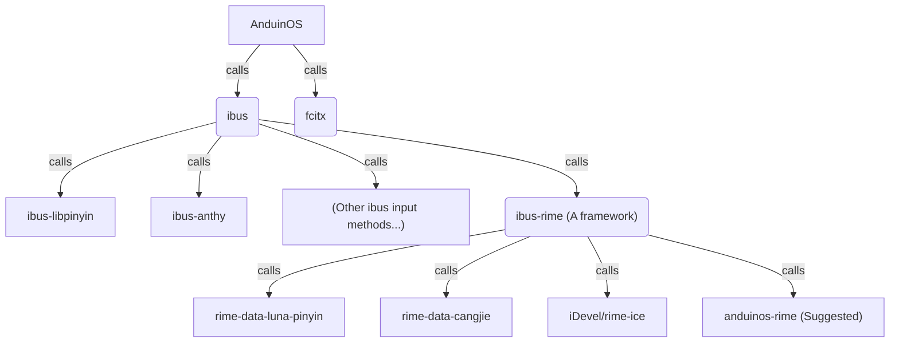

# Install Input Method

By default, AnduinOS uses `ibus` as the input method framework.

During the installation, the installer may installed an `ibus` input method engine for you.

For example:

* if you choose `Chinese` as the default language, the installer will install [ibus-libpinyin](https://github.com/libpinyin/ibus-libpinyin) for you.
* If you choose `Japanese` as the default language, the installer will install [ibus-anthy](https://github.com/phuang/ibus-anthy) for you.
* You can also install your own `ibus` input method engine. For example, `ibus-rime`.

The dependency graph is as follows:



## How to install AnduinOS-Rime as the Chinese input method

To install AnduinOS-Rime, first, you need to install `ibus-rime`.

```bash title="Install ibus-rime"
sudo apt install ibus-rime
```

!!! note "Log out and log back in"

    You **need** to log out and log back in to make the input method available.

Then, you can add `Rime` as the input method.

1. Log in, open `Settings`, go to `Keyboard`.
2. Click on the "+" sign under `Input sources`.
3. Select `Chinese (China)` and then `Chinese (Rime)`.

To install `anduinos-rime`, you can run the following command:

```bash title="Install anduinos-rime"
zip=https://gitlab.aiursoft.cn/anduin/anduinos-rime/-/archive/master/anduinos-rime-master.zip
wget $zip -O anduinos-rime.zip && unzip anduinos-rime.zip && rm anduinos-rime.zip
rsync -Aavx --update --delete ./anduinos-rime-master/assets/ ~/.config/ibus/rime/
rm -rf anduinos-rime-master
```

!!! note "Log out and log back in"

    You **need** to log out and log back in to make the input method available.

Now, you have set `AnduinOS-Rime` as your input method.

To switch between input methods, you can press `Windows + Space`.
