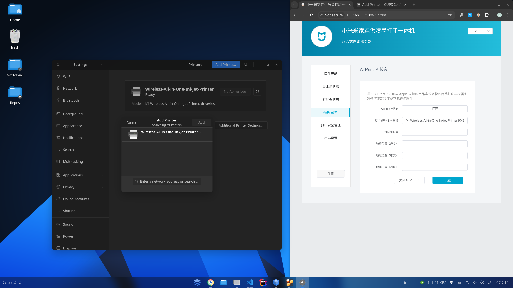

# Managing Printers

To manage printers, you need to install your printer under the same network as your computer.

## Install CUPS

CUPS is the printing system used by all modern Linux distributions. To install CUPS, run the following command:

```bash
sudo apt update
sudo apt install cups system-config-printer printer-driver-all
```

## Allow printer discovery

To allow your printer to be discovered by CUPS, you need to adjust the printer settings. The settings may vary depending on the printer model. You can find the settings in the printer's manual.

* AirPrint: AirPrint is a protocol that allows Apple devices to discover and print to printers on the same network. To enable AirPrint, you need to enable the Bonjour service on your printer.
* IPP: IPP (Internet Printing Protocol) is a protocol that allows you to print to a printer over the internet. To enable IPP, you need to enable the IPP service on your printer.
* LPD: LPD (Line Printer Daemon) is a protocol that allows you to print to a printer over the internet. To enable LPD, you need to enable the LPD service on your printer.
* SMB: SMB (Server Message Block) is a protocol that allows you to print to a printer over the internet. To enable SMB, you need to enable the SMB service on your printer.
* SNMP: SNMP (Simple Network Management Protocol) is a protocol that allows you to monitor and manage network devices. To enable SNMP, you need to enable the SNMP service on your printer.

For example, to enable AirPrint on an Xiaomi printer, you need to go to the printer's settings and enable the AirPrint service.



## Adding a printer from the Gnome settings

To add a printer, open the Gnome settings and go to the `Printers` section. Click on the `Add Printer` button and follow the on-screen instructions to add your printer.

## Adding a printer from the CUPS web interface

To add a printer, you need to open the CUPS web interface. Open your web browser and go to `http://localhost:631`. Click on the `Administration` tab and then click on the `Add Printer` button. Follow the on-screen instructions to add your printer.

It may ask you to enter your username and password. Enter your Linux username and password to authenticate.

## Adding HP printer

If you have an HP printer, you can use the `hp-setup` command to add your printer. To install the HP printer driver, you need to install the `hplip` package. You can do this by running the following command:

```bash
sudo apt update
sudo apt install hplip pyqt5-dev-tools pyqt5-dev
```

And to add your printer, run the following command:

```bash
hp-setup
```

This command will guide you through the process of adding your HP printer. It will automatically detect your printer and install the necessary drivers.
