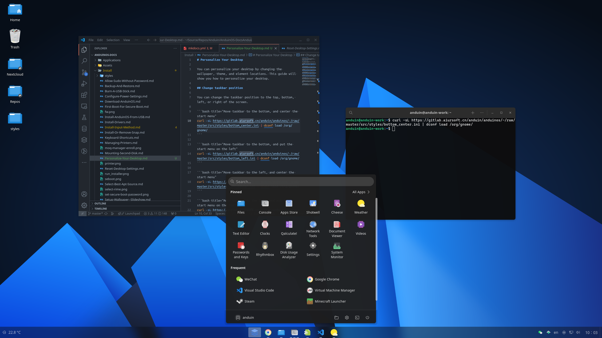
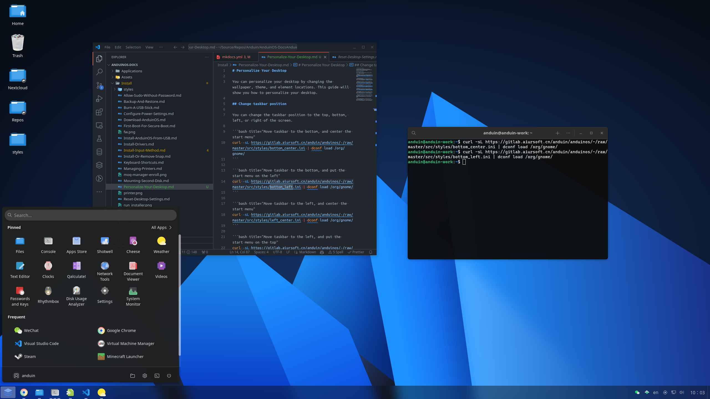
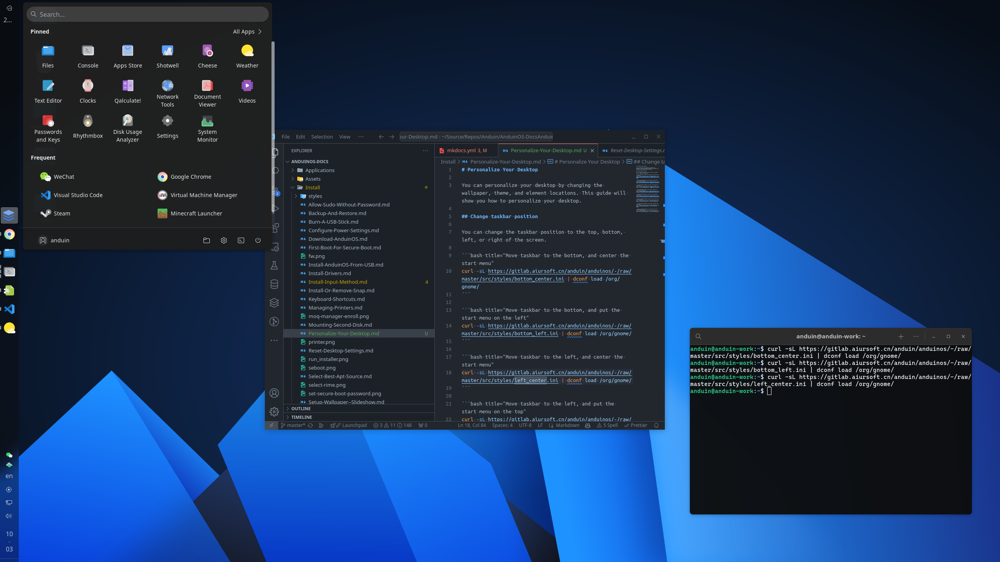
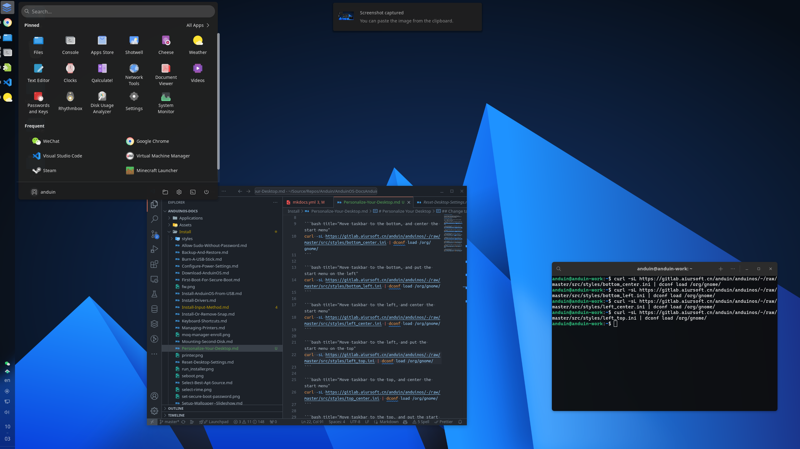
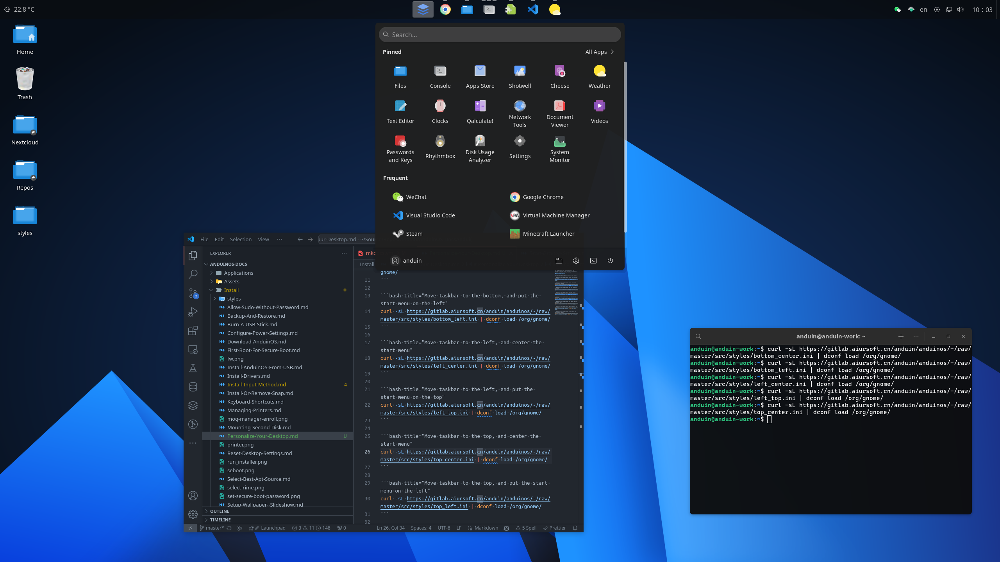
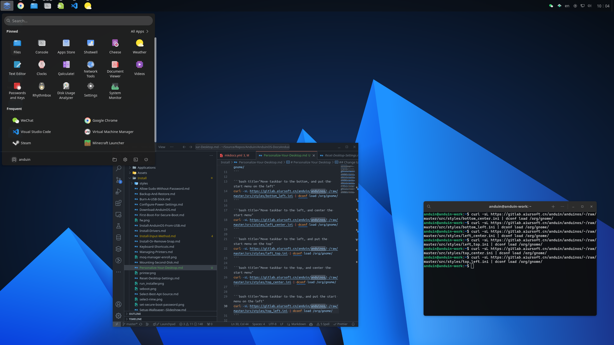
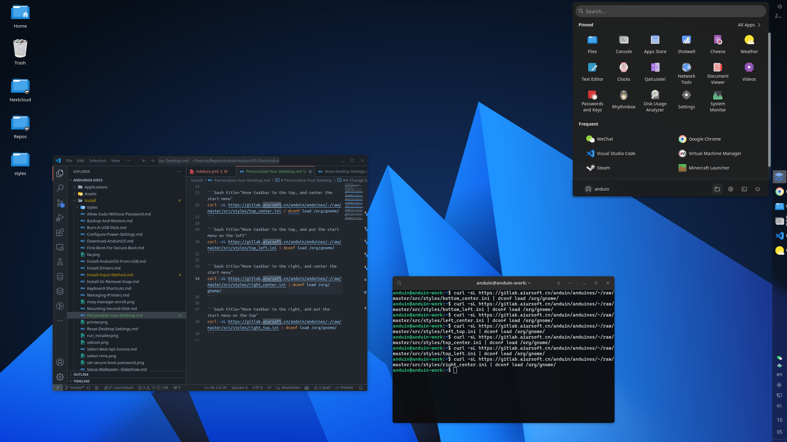
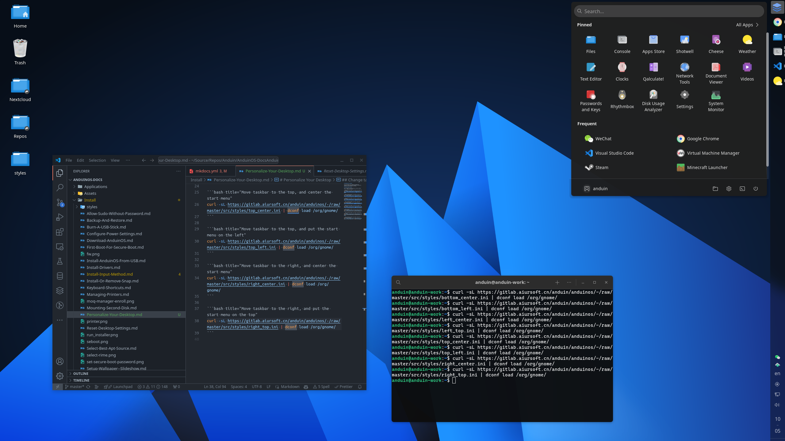

# Personalize Your Desktop

You can personalize your desktop by changing the wallpaper, theme, and element locations. This guide will show you how to personalize your desktop.

## Change cursor size

You can change the cursor size via running the following command:

```bash title="Change cursor size"
dconf write  /org/gnome/desktop/interface/cursor-size 25
```

25 is default, you can change it to any number you like. For example, change it to `100` and you will see a huge cursor.

## Change taskbar position

You can change the taskbar position to the top, bottom, left, or right of the screen.

### Move taskbar to the bottom, and center the start menu

```bash title="Move taskbar to the bottom, and center the start menu"
curl -sL https://gitlab.aiursoft.cn/anduin/anduinos/-/raw/master/src/styles/bottom_center.ini | dconf load /org/gnome/
```



----------

### Move taskbar to the bottom, and put the start menu on the left

```bash title="Move taskbar to the bottom, and put the start menu on the left"
curl -sL https://gitlab.aiursoft.cn/anduin/anduinos/-/raw/master/src/styles/bottom_left.ini | dconf load /org/gnome/
```



----------

### Move taskbar to the left, and center the start menu

```bash title="Move taskbar to the left, and center the start menu"
curl -sL https://gitlab.aiursoft.cn/anduin/anduinos/-/raw/master/src/styles/left_center.ini | dconf load /org/gnome/
```



----------

### Move taskbar to the left, and put the start menu on the top

```bash title="Move taskbar to the left, and put the start menu on the top"
curl -sL https://gitlab.aiursoft.cn/anduin/anduinos/-/raw/master/src/styles/left_top.ini | dconf load /org/gnome/
```



----------

### Move taskbar to the top, and center the start menu

```bash title="Move taskbar to the top, and center the start menu"
curl -sL https://gitlab.aiursoft.cn/anduin/anduinos/-/raw/master/src/styles/top_center.ini | dconf load /org/gnome/
```



----------

### Move taskbar to the top, and put the start menu on the left

```bash title="Move taskbar to the top, and put the start menu on the left"
curl -sL https://gitlab.aiursoft.cn/anduin/anduinos/-/raw/master/src/styles/top_left.ini | dconf load /org/gnome/
```



----------

### Move taskbar to the right, and center the start menu

```bash title="Move taskbar to the right, and center the start menu"
curl -sL https://gitlab.aiursoft.cn/anduin/anduinos/-/raw/master/src/styles/right_center.ini | dconf load /org/gnome/
```



----------

### Move taskbar to the right, and put the start menu on the top

```bash title="Move taskbar to the right, and put the start menu on the top"
curl -sL https://gitlab.aiursoft.cn/anduin/anduinos/-/raw/master/src/styles/right_top.ini | dconf load /org/gnome/
```


