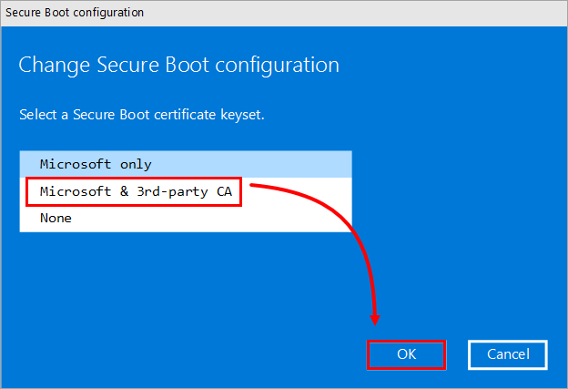
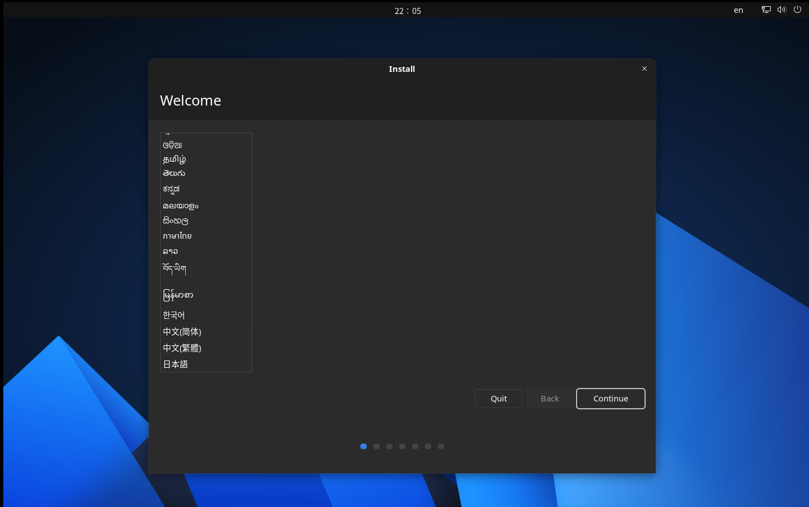

> 核准日期：2024 年 9 月 7 日
> 修改日期：2024 年 9 月 7 日

{ align=right, width=100 }

# AnduinOS 盒装安装媒介 - 使用说明

请仔细阅读本说明书，以确保您正确安装 AnduinOS。

!!! warning "数据风险"

    无论是否与其他操作系统共存，安装 AnduinOS 均存在丢失磁盘上所以数据的风险。请务必在安装前备份您的数据。

## 开始


感谢您选择 AnduinOS！我们将在本文档中指导您如何安装 AnduinOS。

AnduinOS 是一个基于 Debian 的 Linux 发行版，旨在通过保持熟悉的操作习惯和工作流程来帮关注所有用户过渡到 Linux 。

AnduinOS 为您提供了一个完全免费的操作系统，而无须担心许可证。AnduinOS 提供了简易友好的安装程序，以帮助您在几分钟内完成安装。您无需额外的配置和技术知识，即可满足您的日常需求。

AnduinOS 使用了基于 Gnome 的桌面环境，拥有美观的界面和符合用户习惯的人机交互。AnduinOS 共享了 Ubuntu 的软件，还提供了大量的软件包以满足您的日常需求。AnduinOS 还提供了一个简单的软件中心，以帮助您快速找到您需要的软件。


AnduinOS 的设计初中是不收集任何用户的信息，也不会追踪用户。用户在使用 AnduinOS 的过程中是完全匿名的。

通过安全更新，AnduinOS 会修复漏洞并改善安全性并改进性能。我们建议您定期更新系统以确保系统的安全性和稳定性。

## 版权声明

本程序是自由软件：您可以根据自由软件基金会发布的GNU通用公共许可证的条款，重新发布或修改该程序，许可证版本为第3版，或（根据您的选择）任何更高版本。

本程序的发布目的是希望它能带来帮助，但不提供任何担保；甚至不含默示的适销性或特定用途的适用性担保。详情请参阅GNU通用公共许可证。

完整的协议内容，请参阅 https://www.gnu.org/licenses/ 。

继续使用本程序即表示您接受这些条款。

## 盒装内容

AnduinOS 盒装包含以下内容：

* AnduinOS 安装 U 盘
* AnduinOS 安装说明书
* AnduinOS Logo 贴纸

注意: 当您收到盒装安装媒介时，媒介内的 AnduinOS 和文档可能已经不再是最新版本。我们推荐您访问 AnduinOS 的官方网站以浏览最近的版本更新和错误修复。并且，我们建议您在安装前阅读最新的安装说明书。

如果需要访问 AnduinOS 的官方网站，请扫描以下二维码：

{ width=100 }

## 系统要求

安装 AnduinOS 需要满足以下系统要求：

最低系统要求：

| 组件           | 要求                                   |
|----------------|----------------------------------------|
| 架构           | x86_64 架构                            |
| 固件           | UEFI 或 BIOS                           |
| 处理器         | 2 GHz 处理器                           |
| 内存           | 4 GB 内存                              |
| 硬盘空间       | 20 GB 硬盘空间                         |
| 屏幕           | 1024x768 屏幕分辨率                    |
| 接口           | USB 接口或 DVD 驱动器                  |

最佳体验的系统要求：

| 组件           | 要求                                   |
|----------------|----------------------------------------|
| 架构           | x86_64 架构                            |
| 固件           | UEFI 固件                              |
| 处理器         | 2.5 GHz 四核处理器                     |
| 内存           | 8 GB 内存                              |
| 硬盘空间       | 50 GB 硬盘空间                         |
| 屏幕           | 2560x1440 分辨率 27 英寸屏幕            |
| 网络           | 互联网连接                             |
| 安全启动       | 启用安全启动（信任第三方操作系统）     |

!!! note "仅支持 x86_64 架构和兼容 ACPI 的硬件。"

    目前 AnduinOS 仅支持 x86_64 架构。如果您使用的是其他架构，将无法安装 AnduinOS。（不支持 ARM）

    目前 AnduinOS 仅支持兼容 ACPI 的硬件。如果您使用的是不兼容 ACPI 的硬件，将无法安装 AnduinOS。（不支持旧硬件）

    AnduinOS 支持 UEFI 和 BIOS 引导固件。请确保您的硬件兼容 ACPI，以确保正确安装。（不支持 U-boot）

## 验证 U 盘内文件完整性

在安装 AnduinOS 之前，我们建议您验证 U 盘内文件的完整性。这有助于确保 U 盘内的文件没有损坏。

我们在 U 盘内提供了一个 `md5sum.txt` 文件，其中包含了 U 盘内所有文件的 MD5 校验和。您可以使用以下命令验证 U 盘内文件的完整性：

```bash title="验证 U 盘内文件完整性"
md5sum -c md5sum.txt && echo "U 盘内文件完整"
```

如果 U 盘内的文件完整，您将看到以下输出：

```bash
U 盘内文件完整
```

## 将 Secure Boot 调整到 "Other OS"

AnduinOS 支持 UEFI 和 BIOS 引导固件，并且完善的支持 Secure Boot。但是，许多电脑的 BIOS 中的 Secure Boot 选项默认为 "Windows"。这会导致 U 盘无法引导。

如果您的计算机启用了 Secure Boot，我们建议您将 Secure Boot 调整到 "Other OS" 或 "3rd Party CA"。这有助于确保您可以正确引导 U 盘并安装 AnduinOS。



您也可以选择关闭 Secure Boot。但是这会丧失系统对 AnduinOS 内核的完整性验证，从而降低系统的安全性。

## 谨慎搭配 Windows 双系统

当您有双引导时，若另一个操作系统与 Windows 访问相同的文件系统，这就有可能导致问题和数据丢失。在这种情况下，文件系统的真实状态可能与 Windows 认为在“启动”之后的情况不同，并且可能在进一步写入文件系统时导致文件系统损坏。因此，在双引导设置中，为了避免文件系统损坏，有必要在 Windows 中禁用“快速启动”功能。

!!! warning "微软会将 shimx64.efi 从可信的 UEFI 引导项中删除"

    在很多情况中已经观察到，在使用 Windows 进行系统更新时，而可能会出现重新启动后 AnduinOS 的 shimx64.efi 从受信任的 UEFI 引导项中删除。这是由于微软会定期通过 Windows Update 吊销一些数字证书。为了避免这种情况，，我们建议您谨慎的选择将 Windows 与 AnduinOS 安装在同一台计算机上。

!!! warning "备份您的 BitLocker 密钥"

    如果您的 Windows 系统启用了 BitLocker 加密，我们建议您备份您的 BitLocker 密钥。在安装 AnduinOS 时，可能会由于改变了 UEFI 引导项而导致 TPM 无法解锁。因此，我们始终建议您备份您的 BitLocker 密钥以确保您可以在需要时解锁您的 Windows 系统。

    有关备份 BitLocker 密钥的详细信息，请参阅 Microsoft 文档。

## 安装 AnduinOS

安装 AnduinOS 非常简单。您只需将 U 盘插入计算机，然后启动计算机即可。

根据电脑的制造商不同，进入启动设备菜单的方式也不同。通常，您可以按下 `F2`、`F12`、`ESC` 或 `DEL` 键来进入启动设备菜单。如果您不确定如何进入启动设备菜单，请查阅您的计算机的用户手册。

在启动设备菜单中，选择 AnduinOS 的 U 盘。然后，您将看到 AnduinOS 的启动菜单。您将会看到 `Try AnduinOS` 和 `Install AnduinOS` 选项。选择 `Install AnduinOS` 以开始安装。

* `Try AnduinOS`：此选项允许你在不安装系统的情况下试用AnduinOS。你可以探索系统并查看其在电脑上的运行情况。
* `Install AnduinOS`：此选项将开始安装过程。你可以按照屏幕上的指示将AnduinOS安装到电脑上。

安装程序将会引导你完成以下步骤：



* 选择语言：选择安装过程中使用的语言。
* 连接网络：选择如何连接到网络。这一步是可选的，但是我们建议您连接到网络以确保系统安装过程中的更新。
* 选择键盘布局：选择你要使用的键盘布局。
* 更新和其他软件：选择是否在安装过程中安装更新和第三方软件。
* 设置 Mok 密码：如果您启用了 Secure Boot，您需要设置 Mok 密码以确保您可以正确引导 AnduinOS。
* 设置磁盘：选择要安装AnduinOS的磁盘。你还可以选择使用LVM和LUKS2加密磁盘。
* 位置：选择你的位置来设置时区、区域格式、输入法和apt源。
* 用户信息：输入你的姓名、用户名和新用户账户的密码。
* 安装：安装过程将开始，你可以在屏幕上看到进度。
* 完成：安装完成后，系统会提示你重新启动电脑。

在完成安装后，将 U 盘从计算机中取出，然后重新启动计算机。您将看到 AnduinOS 启动。

AnduinOS 在第一次启动前，可能会询问您之前设置的 Secure Boot 密码。请确保您输入正确的密码。这将保证您在更新内核和自定义内核模块时不会遇到问题。


## 安装驱动

AnduinOS 会自动安装大多数硬件的驱动程序。但是，有些硬件可能需要额外的驱动程序。您可以使用以下命令安装额外的驱动程序：

!!! note "如何在 AnduinOS 里打开终端"

    您随时可以按下 `Ctrl + Alt + T` 打开终端。在任何命令前追加 `sudo` 可以以 `root` 权限（也就是管理员权限）运行命令。

```bash title="安装额外的驱动程序"
sudo apt update
sudo ubuntu-drivers install
```

## 更新您的固件

我们建议您在安装 AnduinOS 后更新您的固件。更新固件可以帮助您解决硬件问题，提高系统的稳定性和性能。

```bash title="安装  fwupd"
sudo apt install fwupd
```

运行以下命令以更新您的固件：

```bash title="更新固件"
sudo fwupdmgr refresh
sudo fwupdmgr update
```

同时，我们也建议您在安装后更新您的系统。运行以下命令以更新您的系统：

```bash title="更新系统"
sudo do_anduinos_upgrade
sudo apt update
sudo apt upgrade
```

## 更多内容

在安装 AnduinOS 后，我们还推荐您完成一些后续的配置、安装应用、个性化、挂载其他磁盘、配置打印机等。您可以在 AnduinOS 的官方网站上找到更多的指南和教程。

如果需要访问 AnduinOS 的官方网站，请扫描以下二维码：

{ width=100 }

## 访问应用商店

AnduinOS 提供了一个应用商店，里面列举了一些经过验证的应用。这些应用是经过团队验证可以在 AnduinOS 上安全运行。

您可以在开始菜单中找到 AnduinOS 应用商店。您可以在这里找到您需要的应用。

## 源代码

AnduinOS 是一个开源项目。您可以在 AnduinOS 的 GitLab 仓库中找到源代码。

如果您需要访问 AnduinOS 的 GitLab 仓库，请扫描以下二维码：

{ width=100 }

## 支持

如果您在安装过程中遇到任何问题，请随时联系我们的技术支持团队。我们将竭诚为您提供帮助。

AnduinOS 的支持团队联络方式：

* 电子邮件：anduin@aiursoft.com
* 网站：https://www.anduinos.com
* 论坛：https://github.com/Anduin2017/AnduinOS/discussions
