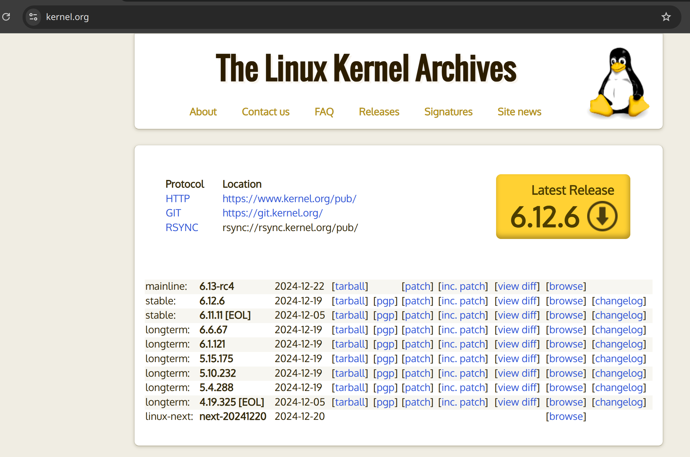
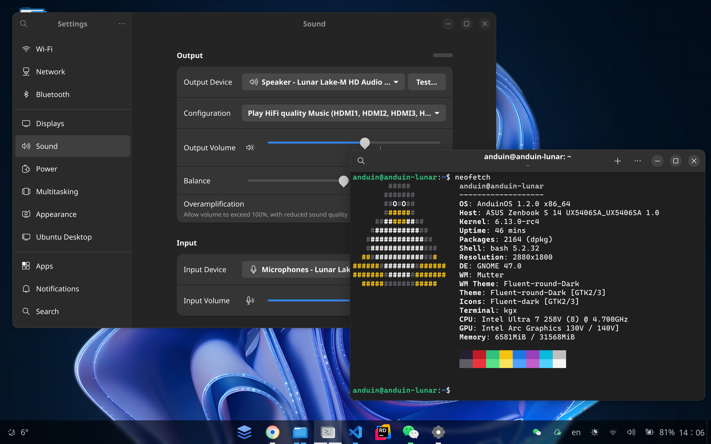

# Build your own kernel

??? tip "Don't be afraid, building your kernel is easy!"

    Usually, stable kernels are easy to build. You can build your own kernel in 5 simple steps.

In some cases, for example:

* When the current Kernel doesn't support your hardware. (e.g. Wi-Fi, Bluetooth, sound, etc.)
* When you need to add a new feature to the Kernel.
* When you need to remove some Kernel features to reduce the Kernel size.
* When you want to have better performance by optimizing the Kernel for your hardware.
* When you want to learn how the Kernel works.

You may need to build your own Kernel.

!!! warning "You don't have to build because you can download from Caonnical"

    You don't have to build your own Kernel because Canonical provides the latest Kernel for Ubuntu. You can install the latest Kernel using the following command.

    ```bash title="Install latest kernel"
    sudo apt search linux-generic-hwe-* | awk -F'/' '/linux-generic-hwe-/ {print $1}' | sort | head -n 1 | xargs -r sudo apt install -y
    sudo reboot
    ```

    However, if the Kernel from Canonical doesn't work for you, you can build your own Kernel.

Here are 5 simple steps to build your own Kernel:

* Get the Kernel source code
* Install the required tools
* Configure the Kernel
* Build the Kernel
* Install the Kernel

## Step 1 - Get the Kernel source code

First, you need to get the Kernel source code. You can get the Kernel source code from the [https://www.kernel.org/](https://www.kernel.org/) website.



### Option 1: Download the Kernel source code from the website

Directly download the Kernel source code from the website. Click the `tarball` link to download the Kernel source code.

Here I'm downloading the Kernel version 6.13-rc4 (xz) as an example.

```bash title="Download the Kernel source code"
link=https://git.kernel.org/torvalds/t/linux-6.13-rc4.tar.xz
wget $link -O linux-6.13-rc4.tar.xz
tar -xJvf ./linux-6.13-rc4.tar.xz
```

If the tarball is a `gz` compressed file, you can use the following command to extract the tarball.

```bash title="Extract the tarball"
tar -zxvf ./linux-6.13-rc4.tar.gz
```

!!! warning "This might not be the latest version of the Kernel!"

### Option 2: Clone the Kernel source code from the Git repository

You can also clone the Kernel source code from the Git repository.

```bash title="Clone the Kernel source code"
sudo apt install -y git
git clone https://git.kernel.org/pub/scm/linux/kernel/git/torvalds/linux.git
```

!!! warning "The latest Tovralds' Kernel may not be able to build!"

    The latest tovralds Kernel may not be stable. It is better to download a stable version of the Kernel.

## Step 2 - Install the required tools

You need to install some tools to build the Kernel.

```bash title="Install the required tools"
sudo apt-get update
sudo apt-get install -y \
  bc \
  bison \
  build-essential \
  ccache \
  clang \
  cpio \
  dwarves \
  flex \
  gcc \
  git \
  gzip \
  libcap-dev \
  libelf-dev \
  liblz4-dev \
  libncurses-dev \
  libssl-dev \
  libudev-dev \
  libzstd-dev \
  lz4 \
  python3 \
  python3-dev \
  python3-distutils-extra \
  python3-setuptools \
  xz-utils \
  zstd
```

Not all of these tools are required to build the Kernel. But it's better to install them to avoid any issues.

## Step 3 - Configure the Kernel

Change directory to the Kernel source code directory.

```bash title="Change directory to the Kernel source code directory"
cd ./linux-6.13-rc4
```

Now, you need to configure the Kernel. You can use the current Kernel configuration as the base configuration.

```bash title="Use the current Kernel configuration"
sudo cp /boot/config-$(uname -r) .config
```

If the kernel you are building is a newer version than the one you are currently using, you **need** to update the configuration.

Run either of the following commands to update the configuration:

```bash title="Update the configuration"
# Automatically migrate old configurations to the new kernel version
make olddefconfig
# Or: Manually update the configuration
make oldconfig
```

### Review the configuration

It is also **suggested** to review the configuration to make sure it is correct.

```bash title="Open the configuration menu to review the kernel configuration"
make menuconfig
```

### Disable Canonical's signing key

You **need** to disable Canonical's signing key because that file is not available on your system.

```bash title="Use an editor to edit the configuration"
vim .config
```

Search for:

* `CONFIG_SYSTEM_TRUSTED_KEYS`
* `CONFIG_SYSTEM_REVOCATION_KEYS`

Comment out those lines.

```ini title="Edit the .config file to comment out the lines"
#CONFIG_SYSTEM_TRUSTED_KEYS="debian/canonical-certs.pem"
#CONFIG_SYSTEM_REVOCATION_KEYS="debian/canonical-revoked-certs.pem"
```

And press `ECS` and `:wq` to save the file.

!!! note "It's optional to disable some features for best performance"

    You can disable some features to get the best performance. For example, you can disable debugging features, unnecessary drivers, etc.

    ```ini title="Edit the .config file to disable some features"
    # Disable most debugging features
    CONFIG_DEBUG_KERNEL=n
    CONFIG_DEBUG_MISC=n
    CONFIG_DEBUG_FS=n

    # Disable generation of additional debug info
    CONFIG_DEBUG_INFO=n
    CONFIG_DEBUG_INFO_DWARF4=n

    # Disable function tracing
    CONFIG_FTRACE=n
    CONFIG_FUNCTION_TRACER=n
    CONFIG_FUNCTION_GRAPH_TRACER=n

    # Disable kcov coverage
    CONFIG_KCOV=n

    # Disable stack protector options if security is not a concern on your build
    CONFIG_CC_STACKPROTECTOR_NONE=y
    # CONFIG_CC_STACKPROTECTOR is not set
    # CONFIG_CC_STACKPROTECTOR_STRONG is not set

    # Disable System Request debugging
    CONFIG_MAGIC_SYSRQ=n

    # Disable profiling
    CONFIG_PROFILING=n
    CONFIG_OPROFILE=n
    ```

## Step 4 - Build the Kernel

Now, you can build the Kernel.

```bash title="Build the Kernel"
make clean
make -j$(nproc)
```

!!! tip "Building the Kernel with only part of the CPU cores"

    In some cases, you may want to build the Kernel using only part of the CPU cores. You can use the `taskset` command to specify the CPU cores to use.

    ```bash title="Build the Kernel"
    taskset -c 0-7 make -j8
    ```

!!! tip "Building the kernel takes around 20 minutes to 2 hours!"

    Various factors can affect the build time, such as the number of CPU cores, the CPU speed, the amount of RAM, and the disk speed. Building the Kernel using all the available CPU cores will reduce the build time.

This command will build the Kernel using all the available CPU cores.

??? note "What if the build fails?"

    If the build fails, you need to fix the issue and run the `make` command again.

    To know what the exact issue is, you can rebuild with a single thread and verbose mode.

    ```bash title="Rebuild to review the error"
    make -j1 V=1
    ```

After building, the Kernel image will be available in the `./arch/x86/boot/bzImage` directory. And the modules will be available in the `./modules` directory. You can install the Kernel and the modules using the following steps.

## Step 5 - Install the Kernel

Now, you can install the Kernel.

```bash title="Install the Kernel"
sudo make modules_install
sudo make install
```

This command will install the Kernel and the modules.

That's it! You have successfully built and installed your own Kernel. Now, you can reboot your system to use the new Kernel.

```bash
sudo reboot
```

After rebooting, you can check the Kernel version using the following command:

```bash title="Check the Kernel version"
uname -r
```



## Step 6 - Sign the Kernel (Optional, only for Secure Boot)

To use your custom kernel with Secure Boot enabled, you need to sign the kernel and its modules using your own keys and enroll them with **MokManager**.

### 1. Generate a Self-Signed Certificate

First, create a private key and a self-signed certificate.

```bash title="Generate a private key and self-signed certificate"
mkdir ~/my-keys
cd ~/my-keys
openssl req -new -newkey rsa:2048 -days 36500 -nodes -keyout MOK.key -out MOK.csr
openssl x509 -req -in MOK.csr -signkey MOK.key -out MOK.crt
openssl x509 -in MOK.crt -outform DER -out MOK.der
```

### 2. Enroll the Certificate with MokManager

Add your certificate to the Machine Owner Key (MOK) list.

```bash title="Import the certificate to MOK"
sudo mokutil --import MOK.der
```

You will be prompted to create a password. **Remember this password**, as you will need it during the next reboot.

### 3. Reboot and Enroll the Key

Reboot your system. During the boot process, the **MokManager** interface will appear.

1. Select **"Enroll MOK"**.
2. Choose **"Continue"**.
3. Enter the password you set earlier.
4. Confirm to enroll the key and reboot.

To verify if the key is enrolled, run the following command:

```bash title="Verify the key is enrolled"
sudo mokutil --list-enrolled
```

### 4. Sign the Kernel Image

After enrolling the key, sign your compiled kernel image. Change directory to the Kernel source code directory.

Sign the kernel image.

```bash title="Sign the kernel image (6.13-rc4 as an example)"
sudo sbsign --key ~/my-keys/MOK.key --cert ~/my-keys/MOK.crt /boot/vmlinuz-[KERNEL-VERSION] --output /boot/vmlinuz-[KERNEL-VERSION].signed
```

Then replace the original kernel image with the signed one.

```bash title="Replace the original kernel image with the signed one"
sudo mv /boot/vmlinuz-[KERNEL-VERSION] ~/kernel-backup
sudo mv /boot/vmlinuz-[KERNEL-VERSION].signed /boot/vmlinuz-[KERNEL-VERSION]
```

To verify if the kernel image is signed, run the following command:

```bash title="Verify the kernel image is signed"
sudo apt install -y pesign
sudo pesign -S -i /boot/vmlinuz-[KERNEL-VERSION]
```

### 5. Sign Kernel Modules

Similarly, sign all necessary kernel modules.

```bash title="Sign kernel modules"
cd ./linux-6.13-rc4 # Change to the Kernel source code directory
for module in $(find /lib/modules/$(uname -r)/kernel/ -type f -name '*.ko'); do
    echo "Signing $module"
    sudo ./scripts/sign-file sha256 ~/my-keys/MOK.key ~/my-keys/MOK.crt "$module"
    if [ $? -ne 0 ]; then
        echo "Failed to sign $module"
        exit 1
    fi
done
```

### 6. Update Bootloader

Ensure your bootloader is aware of the new kernel. Update GRUB if necessary.

```bash title="Update GRUB"
sudo update-grub
```

By following these steps, your custom kernel and its modules are signed with your own keys and trusted by Secure Boot through **MokManager**. This allows you to securely use your custom kernel without disabling Secure Boot.

To verify if your kernel is signed and trusted by Secure Boot, run the following command:

```bash
sudo dmesg | grep -i 'cert'
sudo mokutil --sb-state
```

### 7. Install NVIDIA Drivers (Optional)

After building the Kernel, since NVIDIA drivers are out of the Kernel tree, you need to reinstall the NVIDIA drivers.

Please read the instructions in the [Install NVIDIA Drivers](../../Install/Install-Nvidia-Drivers.md) guide.
