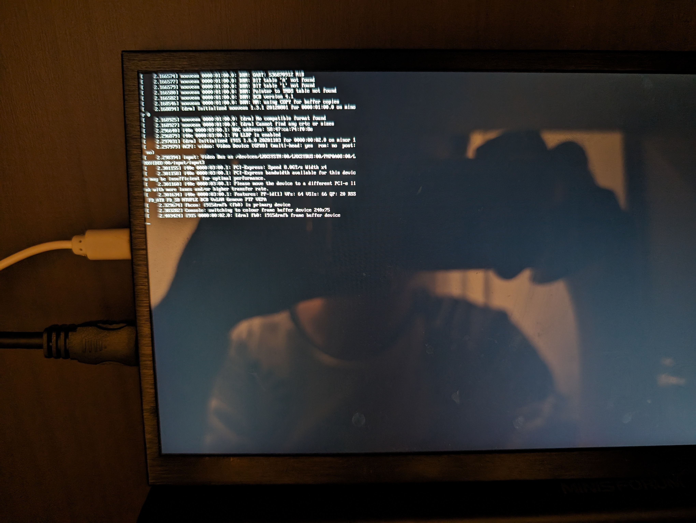

# Terminal Mode

Terminal mode is a feature that allows you to interact with the system using a command-line interface. This mode is useful for advanced users who prefer to work with the system using commands.

For example, if you need to install Nvidia drivers, host as a server, or running a benchmark tool which requires minimal resources, you can use terminal mode to interact with the system.



## Enter Terminal Mode via TTY

The easiest way to switch to terminal mode is to use the TTY (Teletype) interface. You can switch to the TTY interface by pressing `Ctrl + Alt + F1` to `F6`. Each TTY interface represents a different terminal session.

To switch to terminal mode, press `Ctrl + Alt + F3` to `F6`. You can switch back to the graphical mode by pressing `Ctrl + Alt + F2` or `Ctrl + Alt + F1`.

## Enter Terminal Mode via systemd

To switch to terminal mode using systemd, you can use the following commands:

```bash
sudo systemctl isolate multi-user.target
sudo systemctl stop gdm3.service
```

If you want to switch back to the graphical mode, you can use the following command:

```bash
sudo systemctl start gdm3.service
sudo systemctl isolate graphical.target
```

## Uninstalling the Desktop Environment

If you want to remove the desktop environment, you can use the following to uninstall GNOME Shell and GDM3:

```bash
sudo apt autoremove --purge gnome-shell gdm3
```

Set system default target to multi-user.target:

```bash
sudo systemctl set-default multi-user.target
```

And then reboot the system:

```bash
sudo reboot
```

Now, the system will boot into terminal mode by default and no longer start the graphical environment.
