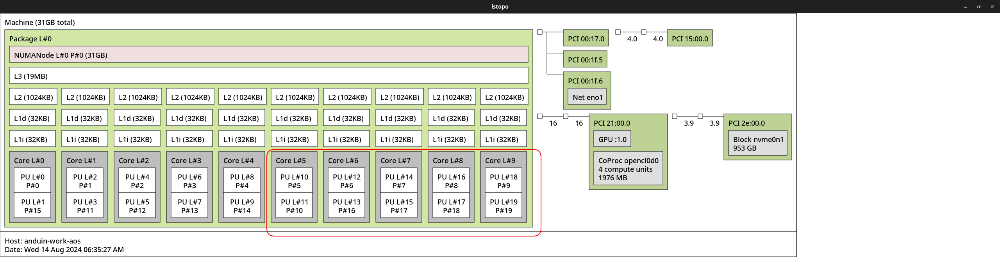
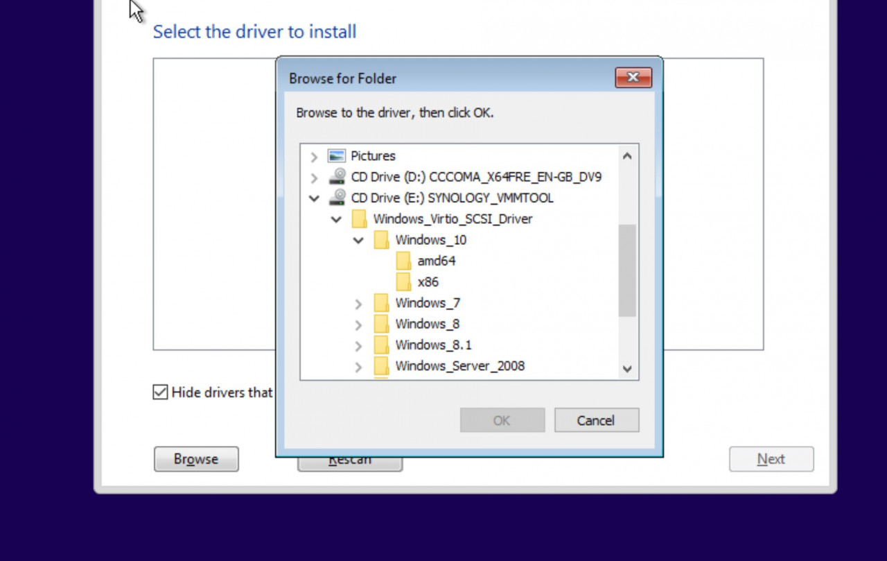

# Virtualizing Windows

In some cases, you may need to run Windows on your AnduinOS. This can be done using a virtual machine. There are several virtualization software options available. In this document, we will use KVM/QEMU as an example.

Before starting, we need to understand the following concepts:

* **KVM**: Kernel-based Virtual Machine. It is a virtualization module in the Linux kernel that allows the kernel to act as a hypervisor.
* **QEMU**: Quick Emulator. It is a generic and open-source machine emulator and virtualizer. QEMU needs KVM to run virtual machines at near-native speed.
* **libvirt**: A toolkit to interact with the virtualization capabilities of Linux. It provides a common API for managing virtual machines.
* **Virtual Machine Manager (virt-manager)**: A desktop application for managing virtual machines through libvirt. Written in Python, it provides a graphical interface to manage VMs.
* **VirtIO**: A virtualization standard for network and disk device drivers. It provides better performance and scalability compared to traditional drivers.
* **IO MMU**: Input/Output Memory Management Unit. It is a hardware component that translates virtual addresses to physical addresses for I/O devices. It is required for high-performance virtualization.
* **SPICE**: Simple Protocol for Independent Computing Environments. It is a remote display system built for virtual environments. It provides better performance and features than VNC.
* **VNC**: Virtual Network Computing. It is a graphical desktop-sharing system that uses the Remote Frame Buffer protocol to remotely control another computer.
* **QXL**: A high-performance display driver for the SPICE protocol. It provides better performance and features than the standard VGA driver.
* **Hyper-V**: A hypervisor developed by Microsoft. It is available on Windows Server and Windows 10 Pro/Enterprise/Education editions. It
* **Serial controller**: A device that allows communication between the host and guest through a serial port. It is useful for debugging and logging.
* **SCSI controller**: A device that allows the guest to access SCSI devices. It provides better performance and features than the standard IDE controller.
* **QCOW2**: A disk image format used by QEMU. It supports copy-on-write, encryption, and compression.

## Installing KVM/QEMU

To install KVM/QEMU on AnduinOS, run the following command:

```bash
sudo apt install qemu-kvm
```

To check if KVM is enabled, run the following command:

```bash title="Check KVM"
kvm-ok
```

You may see the following output:

> INFO: /dev/kvm exists
> KVM acceleration can be used

To install libvirt and virt-manager, run the following command:

```bash title="Install libvirt and virt-manager"
sudo apt update
sudo apt install virt-manager libvirt-daemon-system libvirt-clients virt-viewer
```

After installing libvirt and virt-manager, you need to add your user to the `libvirt` group to manage virtual machines. Run the following command:

```bash title="Add user to libvirt group"
sudo adduser $USER libvirt
sudo adduser $USER kvm
```

To create a shortcut for virt-viewer, run the following command:

```bash title="Create virt-viewer shortcut"
sudo apt install virt-viewer
#cat << EOF > /usr/share/applications/virt-viewer.desktop
echo "
[Desktop Entry]
Name=Virt Viewer
Comment=Connect to virtual machines
Exec=virt-viewer
Icon=virt-viewer
Terminal=false
Type=Application
Categories=System;" | sudo tee /usr/share/applications/virt-viewer.desktop
```

## Setting up IO-MMU

In some cases, you may need to pass through a PCIe device to a virtual machine. For example, if you want your virtual machine to have direct access to a GPU.  To do this, you need to enable IOMMU in the BIOS and add the `iommu=pt` kernel parameter.

To enable IOMMU in the BIOS, you need to reboot your system, press `F2` or `Delete` to enter the BIOS settings, and enable IOMMU in the settings. On Intel PCs, it may be called `VT-d`, and on AMD PCs, it may be called `AMD-Vi`.

Then you need to [Edit kernel parameter](../../../Skills/System-Management/Update-Kernel-Parameters.md).

* `hugepagesz=1G` and `default_hugepagesz=2M` will enable huge pages with a size of 1GB and 2MB. It may improve the performance of the virtual machine.
* `intel_iommu=on` and `iommu=pt` will enable IOMMU and pass-through mode. For AMD CPUs, you can use `amd_iommu=on` and `iommu=pt`.
* `cpufreq.default_governor=performance` will set the CPU frequency governor to performance mode. It may improve the performance of the virtual machine.

Finally, my GRUB configuration file looks like this:

```bash title="GRUB configuration file"
GRUB_CMDLINE_LINUX_DEFAULT="quiet splash hugepagesz=1G default_hugepagesz=2M intel_iommu=on iommu=pt cpufreq.default_governor=performance"
```

Make sure to update the GRUB configuration and reboot your system to apply the changes.

```bash title="Update GRUB configuration"
sudo update-grub
sudo reboot
```

After rebooting, you can check if IOMMU is enabled by running:

```bash title="Check IOMMU"
#!/bin/bash
shopt -s nullglob
for d in /sys/kernel/iommu_groups/*/devices/*; do
    n=${d#*/iommu_groups/*}; n=${n%%/*}
    printf 'IOMMU Group %s ' "$n"
    lspci -nns "${d##*/}"
done;
```

If you see the IOMMU groups, it means IOMMU is enabled. You can now pass through a PCIe device to a virtual machine.

## Ignore MSRs

In some cases, you may need to ignore MSRs (Model Specific Registers). This is because some drivers may touch some MSRs that are not allowed in the virtual machine. To ignore MSRs, you need to add the `kvm.ignore_msrs=1` kernel parameter.

To do that, run the following command:

```bash title="Ignore MSRs"
echo "options kvm ignore_msrs=1" | sudo tee /etc/modprobe.d/vfio.conf
```

Then update the initramfs and reboot your system:

```bash title="Update initramfs"
sudo update-initramfs -u -k all
sudo reboot
```

That's it! You have successfully ignored MSRs.

## Prepare devices for passthrough

!!! note "Why desktop experience is bad in virtual machines?"

    A lot of people complain about the low performance and bad experience of virtual machines. This is because the virtual machine is not able to access the hardware directly. Especially for GPU.

    The virtual machine couldn't have GPU accelerated Desktop experience. To solve this problem, we can pass through the GPU to the virtual machine. This also applies to other devices like USB controllers, network cards, etc.

For example, if you want to pass through a GPU to a virtual machine, you need to offline the GPU before passing it through. To do this, you can follow these steps:

First, you need to know the PCI address of the GPU. You can find it by running:

```bash title="Find PCI Address"
lspci
```

For example, I have two NVIDIA Quadro P620 GPUS. The addresses are `15:00.0` to `15:00.1` and `21:00.0` to `21:00.1`. You can see the addresses by running:

```bash
anduin@anduin-work-aos:~$ lspci | grep NVIDIA
15:00.0 VGA compatible controller: NVIDIA Corporation GP107GL [Quadro P620] (rev a1)
15:00.1 Audio device: NVIDIA Corporation GP107GL High Definition Audio Controller (rev a1)
21:00.0 VGA compatible controller: NVIDIA Corporation GP107GL [Quadro P620] (rev a1)
21:00.1 Audio device: NVIDIA Corporation GP107GL High Definition Audio Controller (rev a1)
```

!!! note "Multiple devices in the same IOMMU group"

    In the example above, NVIDIA Quadro P620 and it's audio device are listed. And the two devices are in the same IOMMU group. You need to offline both devices.

Then you need to tell Linux kernel to unbind the GPU from the driver. You can do this by running:

!!! warning "Update the ID to your GPU ID!"

    Update the ID in the script below to your GPU ID. For example, I want to pass through `21:00.0` and `21:00.1`, so I will update the script below to `0000:21:00.0` and `0000:21:00.1`. Update the values to your own PCIe address!

```bash title="Unbind a PCIe Device"
cat << EOF > /etc/initramfs-tools/scripts/init-top/vfio.sh

PREREQS=""

prereqs() { echo "$PREREQS"; }

case "$1" in
    prereqs)
    prereqs
    exit 0
    ;;
esac

#!/bin/sh

for dev in 0000:21:00.0 0000:21:00.1 # Update the values to your own PCIe address!
do 
 echo "vfio-pci" > /sys/bus/pci/devices/\$dev/driver_override 
 echo "\$dev" > /sys/bus/pci/drivers/vfio-pci/bind 
done

exit 0
EOF
sudo chmod +x /etc/initramfs-tools/scripts/init-top/vfio.sh
```

Then update the initramfs and reboot your system:

```bash title="Update initramfs"
sudo update-initramfs -u -k all
sudo reboot
```

To make sure a PCIe device is offline and ready to pass through, you can run:

```bash title="Verify Isolation"
lspci -nnv -s 21:00.0 # Update the address `21:00.0` to your own PCIe address!
```

For example, for my NVIDIA P620 on `21:00.0` it shows:

```bash
anduin@anduin-work-aos:~$ lspci -nnv -s 21:00.0
21:00.0 VGA compatible controller [0300]: NVIDIA Corporation GP107GL [Quadro P620] [10de:1cb6] (rev a1) (prog-if 00 [VGA controller])
    ...
    Kernel driver in use: vfio-pci
```

And for the other device `15:00.0`:

```bash
anduin@anduin-work-aos:~$ lspci -nnv -s 15:00.0
15:00.0 VGA compatible controller [0300]: NVIDIA Corporation GP107GL [Quadro P620] [10de:1cb6] (rev a1) (prog-if 00 [VGA controller])
    ...
    Kernel driver in use: nvidia
```

If you see the `Kernel driver in use: vfio-pci`, it means the GPU is offline and ready to pass through.

!!! danger "Dangerous if you only have one GPU!!"

    If you only have one GPU, offline it may cause the display to go black! In this case, make sure you have a remote connection and a virtual adapter on your machine before offline the GPU.

## Download Windows ISO

To install Windows on a virtual machine, you need to download the Windows ISO file. You can download it from the [official Microsoft website](https://www.microsoft.com/en-us/software-download/windows10).

After downloading the ISO file, you can use it to install Windows on the virtual machine.

## Create a Virtual Machine

To create a virtual machine using virt-manager, follow these steps:

1. Open virt-manager by running:

```bash
virt-manager
```

2. Click on the `Create a new virtual machine` button.
3. Select `Local install media (ISO image or CDROM)` and click `Forward`.
4. Click on `Browse` and select the Windows ISO file you downloaded.
5. Click `Forward`.
6. Select the operating system type and version. For Windows, select `Microsoft Windows` and the version you are installing. Click `Forward`.
7. Allocate memory to the virtual machine. Click `Forward`.
8. Create a virtual disk for the virtual machine. You can choose the disk size and format. Click `Forward`.
9. Review the summary and click `Finish`.

After creating the virtual machine, you can start the installation process by clicking on the `Begin installation` button.

## Adjust Virtual Machine Settings

After creating the virtual machine, you may want to adjust the settings to improve the performance and features of the virtual machine. You can do this by editing the virtual machine settings in virt-manager.

In this section, we need to adjust XML configuration of the virtual machine. To do this, you need to enable XML editing in virt-manager.

First, open `Virt-Manage` and create a new virtual machine. Then, go to `Edit` -> `Preferences` -> `General` and enable `Enable XML editing`.

Then, open your virtual machine. Click `Show virtual hardware details` -> `Overview` and then you can adjust the settings of the virtual machine.

We need to adjust the following settings:

### Switch the network adapter to VirtIO

To improve the performance of the virtual machine, you can switch the network adapter to VirtIO. The VirtIO network adapter provides better performance and features compared to the standard network adapter.

To switch the network adapter to VirtIO, you need to add the following lines to the XML configuration:

```xml title="Switch the network adapter to VirtIO"
<interface type="network">
    <mac address="52:54:00:91:31:f2"/>
    <source network="default"/>
    <model type="virtio"/>
    <address type="pci" domain="0x0000" bus="0x01" slot="0x00" function="0x0"/>
</interface>
```

Or you can do that via the GUI by clicking on the network adapter and selecting `virtio` as the model.

### Add new SCSI VirtIO disk

To improve the performance of the virtual machine, you can add a new SCSI VirtIO disk to the virtual machine. The VirtIO disk provides better performance and features compared to the standard disk.

To add a new SCSI VirtIO disk, you need to add the following lines to the XML configuration:

```xml title="Add new SCSI VirtIO disk"
<disk type="file" device="disk">
    <driver name="qemu" type="qcow2" cache="writeback" discard="unmap"/>
    <source file="/var/lib/libvirt/images/windows.qcow2"/>
    <target dev="vda" bus="virtio"/>
    <address type="pci" domain="0x0000" bus="0x05" slot="0x00" function="0x0"/>
</disk>
```

Or you can do that via the GUI by clicking on the `Add Hardware` button and selecting `Storage` -> `Disk` -> `Device type: Disk device` -> `Bus type: VirtIO`.

Don't forget to remove the old disk.

### Add VirtIO serial controller

To improve the performance of the virtual machine, you can add a VirtIO serial controller to the virtual machine. The VirtIO serial controller provides better performance and features compared to the standard serial controller.

To add a VirtIO serial controller, you need to add the following lines to the XML configuration:

```xml title="Add VirtIO serial controller"
<controller type="virtio-serial" index="0">
    <address type="pci" domain="0x0000" bus="0x04" slot="0x00" function="0x0"/>
</controller>
```

Or you can do that via the GUI by clicking on the `Add Hardware` button and selecting `Controller` -> `Serial` -> `Device type: VirtIO serial controller`.

### Add VirtIO SCSI controller

To improve the performance of the virtual machine, you can add a VirtIO SCSI controller to the virtual machine. The VirtIO SCSI controller provides better performance and features compared to the standard SCSI controller.

To add a VirtIO SCSI controller, you need to add the following lines to the XML configuration:

```xml title="Add VirtIO SCSI controller"
<controller type="scsi" index="0" model="virtio-scsi">
    <address type="pci" domain="0x0000" bus="0x03" slot="0x00" function="0x0"/>
</controller>
```

Or you can do that via the GUI by clicking on the `Add Hardware` button and selecting `Controller` -> `SCSI` -> `Device type: VirtIO SCSI controller`.

### Add VirtIO RNG

To improve the performance of the virtual machine, you can add a VirtIO RNG (Random Number Generator) to the virtual machine. The VirtIO RNG provides better performance and features compared to the standard RNG.

To add a VirtIO RNG, you need to add the following lines to the XML configuration:

```xml title="Add VirtIO RNG"
<rng model="virtio">
    <backend model="random">/dev/urandom</backend>
    <address type="pci" domain="0x0000" bus="0x07" slot="0x00" function="0x0"/>
</rng>
```

### Add USB controller

You can add a USB controller to the virtual machine. The USB controller provides better performance and features compared to the standard USB controller.

To add a USB controller, you need to add the following lines to the XML configuration:

```xml title="Add USB controller"
<controller type="usb" index="0" model="qemu-xhci" ports="15">
    <address type="pci" domain="0x0000" bus="0x02" slot="0x00" function="0x0"/>
</controller>
```

Or you can do that via the GUI by clicking on the `Add Hardware` button and selecting `Controller` -> `USB` -> `Device type: USB controller`.

## Mount VirtIO Drivers CD-ROM

To improve the performance of the virtual machine, you need to add the VirtIO drivers CD-ROM to the virtual machine. The VirtIO drivers provide better performance and features for network and disk devices.

!!! warning "You must add this CD-ROM before installing Windows!"

    You must add the VirtIO drivers CD-ROM before installing Windows. Otherwise, Windows may not detect the network and disk devices.

Download the VirtIO drivers from the official website: [https://fedorapeople.org/groups/virt/virtio-win/direct-downloads/stable-virtio/virtio-win.iso](https://fedorapeople.org/groups/virt/virtio-win/direct-downloads/stable-virtio/virtio-win.iso). Please download this on your Host.

Then, add the VirtIO drivers CD-ROM to the virtual machine by following these steps:

1. Open virt-manager.
2. Click on the virtual machine you created.
3. Click on `View` -> `Details`.
4. Click on `Add Hardware`.
5. Select `Storage`.
6. On `Disk Type`, select `CDROM device`.
7. On `Bus Type`, select `SATA`.
8. Select `Select for custom storage`. Click `Manage` and select the VirtIO drivers ISO file you downloaded.
9. Click `Finish`.

After adding the VirtIO drivers CD-ROM, you can install the VirtIO drivers during the Windows installation process.

## Enable UEFI for Virtual Machines

For Windows virtual machines, you may want to enable UEFI (Unified Extensible Firmware Interface) to improve the performance and features of the virtual machine. UEFI is a modern replacement for the traditional BIOS (Basic Input/Output System) and provides better security and features.

To enable UEFI for your virtual machines, you need to adjust the settings of the virtual machine.

First, open `Virt-Manage` and create a new virtual machine. Then, go to `Edit` -> `Preferences` -> `General` and enable `Enable XML editing`.

Then, open your virtual machine. Click `Show virtual hardware details` -> `Overview` and add the following lines to the XML configuration:

```xml title="Enable UEFI"
<os firmware="efi">
    ...
</os>
```

That's it!

## Enable Secure Boot for Virtual Machines

For Windows virtual machines, you may want to enable Secure Boot to improve the security of the virtual machine. Secure Boot is a feature of UEFI that ensures that the system only runs software that is signed by a trusted certificate authority. If you want to enable Secure Boot for your virtual machines, you need to adjust the settings of the virtual machine.

First, open `Virt-Manage` and create a new virtual machine. Then, go to `Edit` -> `Preferences` -> `General` and enable `Enable XML editing`.

Then, open your virtual machine. Click `Show virtual hardware details` -> `Overview` and add the following lines to the XML configuration:

```xml title="Enable Secure Boot"
<os firmware="efi">
    ...
    <firmware>
        <feature enabled="yes" name="enrolled-keys"/>
        <feature enabled="yes" name="secure-boot"/>
    </firmware>
    ...
</os>
```

## Enable simulated TPM for Virtual Machines

TPM is a hardware-based security feature that provides a secure way to store cryptographic keys and perform cryptographic operations. A lot of Windows features require TPM, such as BitLocker, Windows Hello, and Windows Defender Credential Guard.

If you want to enable a simulated TPM for your virtual machines, you need to adjust the settings of the virtual machine.

First, install `swtpm` by running the following command on host:

```bash
sudo apt install swtpm swtpm-tools
```

Then, open `Virt-Manage` and create a new virtual machine. Then, go to `Edit` -> `Preferences` -> `General` and enable `Enable XML editing`.

Then, open your virtual machine. Click `Show virtual hardware details` -> `Overview` and add the following lines to the XML configuration:

```xml title="Enable simulated TPM"
<devices>
    ...
    <tpm model="tpm-tis">
      <backend type="emulator" version="2.0"/>
    </tpm>
    ...
</devices>
```

## Pass through a PCIe Device

To pass through a PCIe device to a virtual machine, you can follow these steps:

First, open `Virt-Manage` and create a new virtual machine. Then, go to `Edit` -> `Preferences` -> `General` and enable `Enable XML editing`.

### Pass through via GUI

Then, open your virtual machine. Click `Show virtual hardware details` -> `Add Hardware` -> `PCI Host Device` and add the PCIe device you want to pass through.

### Pass through via XML

And also you can add the following lines to the XML configuration:

The `<hostdev>.<source>.<address>` is the address of the PCIe device you want to pass through. You can find the address by running `lspci`.

For example, when I want to pass through `0000:21:00.0` and `0000:21:00.1`, I will add the following lines to the XML configuration:

The `<hostdev>.<alias>` is the name of the device. You can name it with `hostdev0`, `hostdev1`, etc.

The `<hostdev>.<address>` is the address of the PCIe device in the virtual machine. You can set the domain, bus, slot, and function of the device.

```xml title="Pass through a PCIe Device"
<devices>
    ...
    <hostdev mode="subsystem" type="pci" managed="yes">
        <driver name="vfio"/>
        <source>
            <!-- Pass through the address of 0000:21:00.0 -->
            <address domain="0x0000" bus="0x21" slot="0x00" function="0x0"/>
        </source>
        <alias name="hostdev0"/>
        <!-- I take the bus 0x06 in virtual machine -->
        <address type="pci" domain="0x0000" bus="0x06" slot="0x00" function="0x0"/>
    </hostdev>
    <hostdev mode="subsystem" type="pci" managed="yes">
        <driver name="vfio"/>
        <source>
            <!-- Pass through the address of 0000:21:00.1 -->
            <address domain="0x0000" bus="0x21" slot="0x00" function="0x1"/>
        </source>
        <alias name="hostdev1"/>
        <!-- I take the bus 0x07 in virtual machine -->
        <address type="pci" domain="0x0000" bus="0x07" slot="0x00" function="0x0"/>
    </hostdev>
    ...
</devices>
```

!!! warning "Update the XML to match your own PCIe address!"

    Update the XML configuration to match your own PCIe address. And the address in the virtual machine should be unique.

## Tune Windows VM for better performance

Windows only enable some performance feature when it detects that it is running on a Hyper-V hypervisor. To enable these features, you can add the following lines to the XML configuration:

First, open `Virt-Manage` and create a new virtual machine. Then, go to `Edit` -> `Preferences` -> `General` and enable `Enable XML editing`.

Then, open your virtual machine. Click `Show virtual hardware details` -> `Overview` and add the following lines to the XML configuration:

```xml title="Enable Hyper-V features for better performance"
<features>
    ...
    <hyperv mode="passthrough">
        <relaxed state="on"/>
        <vapic state="on"/>
        <spinlocks state="on" retries="8191"/>
        <vpindex state="on"/>
        <runtime state="on"/>
        <synic state="on"/>
        <stimer state="on"/>
        <reset state="off"/>
        <vendor_id state="on" value="intel"/>
        <frequencies state="on"/>
        <reenlightenment state="off"/>
        <tlbflush state="on"/>
        <ipi state="on"/>
    </hyperv>
    ...
</features>
```

That's it! Now you can try benchmarking your virtual machine to see if the performance is improved.

## Isolate CPU Cores for Virtual Machines

By default, the CPU cores are shared among all virtual machines. This will cause the CPU scheduler by both VM and host to cause additional latency.

It is suggested to isolate CPU cores for virtual machines, you can follow these steps:

First, open `Virt-Manage` and create a new virtual machine. Then, go to `Edit` -> `Preferences` -> `General` and enable `Enable XML editing`.

Then, open your virtual machine. Click `Show virtual hardware details` -> `Overview` and edit the XML configuration.

First, edit the domain XML and add the following lines:

```xml title="Edit the domain XML"
<domain xmlns:qemu="http://libvirt.org/schemas/domain/qemu/1.0" type="kvm">
  ...
</domain>
```

Then, add the following lines to the XML configuration:

```xml title="Set CPU overcommit"
<domain xmlns:qemu="http://libvirt.org/schemas/domain/qemu/1.0" type="kvm">
  ...
  <qemu:commandline>
    <qemu:arg value="-overcommit"/> 
    <qemu:arg value="cpu-pm=on"/>
  </qemu:commandline>
  ...
</domain>
```

And now you need to plan your CPU cores for the virtual machine.

!!! note "A sample plan for isolating half of the Intel Hyper-Threading CPU cores (10 cores 20 threads)"

    "Hyper-Threading" is a technology that allows a single physical CPU core to act as two logical CPUs. 20 Logical CPUs will be shown as `0-19` in the system.

    In my case, I want my virtual machine to have half of the physical CPU performance. So I want to bind 0-4 physical cores (0-9 logical CPUs) to the host and 5-9 physical cores (10-19 logical CPUs) to the virtual machine.

First you need to understand which logical CPU cores numbers are in the same physical core. You can run the following command to find out:

```bash title="Find out CPU core numbers"
sudo apt install hwloc
sudo lstopo
```

It may output a graph like this:



And as the topology shows, the logical CPU cores `10-19` are in physical core `5-9`. You can isolate the CPU cores by editing the domain XML:

* I want to bind 5 cores
* 5 x 2 = 10, so 10 logical CPUs are needed
* the `0-9` CPUs in virtual machine are `10-19` in the host
* threads should be 2
* cores should be 5
* dies should be 1
* sockets should be 1

```xml title="Isolate CPU cores"
<domain xmlns:qemu="http://libvirt.org/schemas/domain/qemu/1.0" type="kvm">
  ...
  <!-- 10 logical CPUs -->
  <vcpu placement="static">10</vcpu>

  <!-- the `0-9` CPUs in virtual machine are `10-19` in the host -->
  <cputune>
    <vcpupin vcpu="0" cpuset="10"/>
    <vcpupin vcpu="1" cpuset="11"/>
    <vcpupin vcpu="2" cpuset="12"/>
    <vcpupin vcpu="3" cpuset="13"/>
    <vcpupin vcpu="4" cpuset="14"/>
    <vcpupin vcpu="5" cpuset="15"/>
    <vcpupin vcpu="6" cpuset="16"/>
    <vcpupin vcpu="7" cpuset="17"/>
    <vcpupin vcpu="8" cpuset="18"/>
    <vcpupin vcpu="9" cpuset="19"/>
  </cputune>

  <!-- CPU topology, threads should be 2, cores should be 5, dies should be 1, sockets should be 1 -->
  <cpu mode="host-passthrough" check="none" migratable="on">
    <topology sockets="1" dies="1" cores="5" threads="2" />
  </cpu>
  ...
</domain>
```

As the configuration above, the virtual machine will use the CPU cores `10-19` and the CPU topology is set to 5 cores and 2 threads (Hyper-Threading), on one socket and one die.

After that, you can start the virtual machine and check if the CPU cores are isolated. You should see 10-19 CPUs usage on the host is always 100%.

!!! note "Why CPU usage is always 100% on host?"

    You will see the CPU usage of 10-19 on your host shows always 100% when the virtual machine is running. It is expected behavior because host scheduler no longer schedules the isolated CPU cores. Those cores are over-committed to the virtual machine. But don't worry, the virtual machine will not actually use 100% of the CPU. To check the actual usage, you can check inside the virtual machine, or running:

    ```bash title="View actual CPU usage"
    sudo apt install linux-tools-common linux-tools-$(uname -r)
    sudo turbostat
    ```

    And check the `Busy%` column.

And you don't have to turn your host's CPU frequency governor to performance mode. The virtual machine will have its own CPU frequency governor.

Instead, setting it to `powersave` may save power and reduce heat on the host. You can run the following command to set the CPU frequency governor to `powersave`:

```bash title="Set CPU frequency governor to powersave"
sudo apt install linux-tools-common linux-tools-$(uname -r)
sudo cpupower frequency-set -g powersave
```

To check current CPU frequency governor, you can run:

```bash title="Check CPU frequency governor"
sudo cpupower frequency-info | grep "decide which speed to use"
```

## First Boot the Virtual Machine

After:

* Setting up IO-MMU
* Ignoring MSRs
* Preparing devices for passthrough
* Downloading Windows ISO
* Creating a Virtual Machine
* Adjusting Virtual Machine Settings
* Mounting VirtIO Drivers CD-ROM
* Enabling Secure Boot
* Enabling simulated TPM
* Passing through a PCIe Device
* Tuning Windows VM for better performance
* Isolating CPU Cores for Virtual Machines

Now it's time to first boot the virtual machine. You can start the virtual machine by clicking on the `Start` button in virt-manager.

During the first boot, you need to install Windows on the virtual machine. You can follow the on-screen instructions to install Windows.

Due to lack of VirtIO drivers, you may not see the disk during the installation process. You can load the VirtIO drivers by clicking on the `Load driver` button and selecting the VirtIO drivers CD-ROM. Select the corelative driver for your OS and architecture.



!!! note "What if the virtual machine's screen is always blank?"

    It has been reported that the virtual machine's screen may be always blank with graphics cards like `NVIDIA Geforce RTX 3090` or `NVIDIA Geforce RTX 4090`. If you have this problem, you can try the following steps:

    * Add the parameter `-fw_cfg name=opt/ovmf/X-PciMmio64Mb,string=65536` to qemu command line. You can do that via editing the XML configuration:

    ```xml
    <qemu:commandline>
        <qemu:arg value="-overcommit"/>
        <qemu:arg value="cpu-pm=on"/>
        <qemu:arg value="-fw_cfg"/>
        <qemu:arg value="name=opt/ovmf/X-PciMmio64Mb,string=65536" />
    </qemu:commandline>
    ```

    * Make sure the host machine has enabled IO-MMO on both grub settings and BIOS settings.
    * Make sure the host machine has ignored MSRs.
    * Make sure you uninstalled the driver for the PCIe device you want to pass through. (It has been reported that NVIDIA driver may block the device to pass through) Verify the pci device is running with driver `vfio-pci` by running `lspci -nnv -s 21:00.0`.
    * Make sure the `Above 4G Decoding` and `Re-Size BAR` are enabled in the BIOS settings.
    * Try totally turning off the host machine and turning it on again. Some settings may not be applied without a full reboot.

    If the problem still exists, you may need to read the [Troubleshooting](https://pve.proxmox.com/wiki/PCI_Passthrough) document.

## After Installation

!!! note "You still need to install VirtIO drivers!"

    After installing Windows, you still need to install the VirtIO drivers to improve the performance and features of the virtual machine. You can install the VirtIO drivers by running the `virtio-win-gt-x64.msi` file from the VirtIO drivers CD-ROM.

After installing Windows on the virtual machine, you can adjust the settings and install the necessary software. You can also install the VirtIO drivers to improve the performance and features of the virtual machine.

## Install SPICE Guest Tools

To improve the performance and features of the virtual machine, you can install the SPICE Guest Tools. The SPICE Guest Tools provide better integration between the host and guest, including better display performance and features. (for copy and paste, automatic resolution switching, ...)

To install the SPICE Guest Tools on the Windows guest, follow these steps:

1. Open the browser on the **Windows guest**.
2. Download the SPICE Guest Tools from the official website: [https://www.spice-space.org/download.html](https://www.spice-space.org/download.html).
3. Click on the `Windows` tab and download the latest version of the [SPICE Guest Tools](https://www.spice-space.org/download/windows/spice-guest-tools/spice-guest-tools-latest.exe).
4. Run the `spice-guest-tools-latest.exe` file and follow the on-screen instructions to install the SPICE Guest Tools.
5. After installing the SPICE Guest Tools, you may need to restart the Windows guest to apply the changes.

To see automatic resolution switching, you need `virt-viewer` to open the virtual machine. You can run `virt-viewer` by running:

```bash
virt-viewer
```

Then, click on the virtual machine to open it. You should see the automatic resolution switching when you resize the window.

## Pass through a folder to Windows guest

In some cases, you may want to share a folder between the host and the guest. You can do this by passing through a folder to the Windows guest.

The first step is to configure the sharing in virt-manager. In the VM details view, click on `Add Hardware` and select a `Channel` device. Set the new device name to `org.spice-space.webdav.0` and leave the other fields as-is.

Or you can add the following lines to the XML configuration:

```xml title="Add a Channel device"
<channel type="spiceport">
    <source channel="org.spice-space.webdav.0"/>
    <target type="virtio" name="org.spice-space.webdav.0"/>
    <address type="virtio-serial" controller="0" bus="0" port="2"/>
</channel>
```

Now start the guest machine and install [spice-webdav](https://www.spice-space.org/download/windows/spice-webdavd/) on the guest machine. After installing spice-webdav make sure the `Spice webdav proxy` service is actually running (via services.msc).

Now you **must** use the `virt-viewer` to open the virtual machine. To mount the shared folder, you can click on `File` -> `Preferences` -> `Spice` -> `Folder Sharing` and add the shared folder.

Run `C:\Program File\SPICE webdavd\map-drive.bat` will map the shared folder, which is by default `~/Public`.
